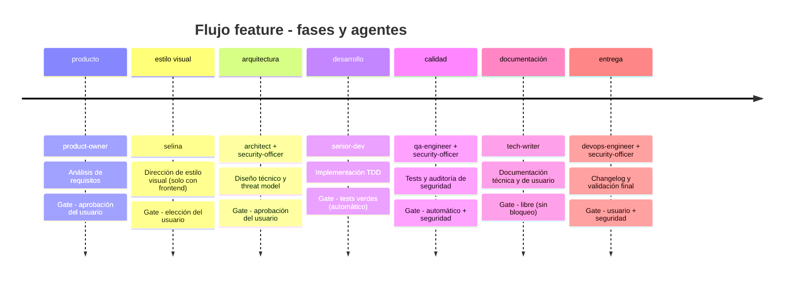

# 686f6c61/alfred-dev

Tu equipo de desarrolladores en un plugin. 10 agentes, 11 skills planas, 18 comandos /alfred-dev:*. Memoria persistente, quality gates con evidencia y MCP local.

## features

El flujo `feature` es el más completo: hasta siete fases secuenciales. La fase `estilo_visual` solo aparece si el proyecto tiene frontend. El `security-officer` interviene en arquitectura, calidad y entrega: la seguridad no es un paso final.



El `security-officer` valida el threat model en arquitectura, audita el código en calidad y da el visto bueno en entrega. Detectar un problema de seguridad pronto sale más barato que detectarlo en producción.

## configuration

El plugin se configura por proyecto con `.claude/alfred-dev.local.md` en la raíz del proyecto. En la primera sesión, `SessionStart` lo crea si falta con autonomía por fases en `autonomo` y memoria activa; después `/alfred-dev:ajustes` permite cambiarlo a `interactivo` o `semi-autonomo`. El único opcional es Lucius:

```yaml
---
autonomia:
  producto: autonomo
  arquitectura: autonomo
  desarrollo: autonomo
  calidad: autonomo
  documentacion: autonomo
  entrega: autonomo

agentes_opcionales:
  lucius: false

memoria:
  enabled: true
  sync_to_native: true
  sync_commits_limit: 10
  capture_decisions: true
  capture_commits: true
  retention_days: 365

personalidad:
  nivel_sarcasmo: 3
  verbosidad: normal
  idioma: es
  celebrar_victorias: true
  insultar_malas_practicas: true
---

Notas adicionales del proyecto que Alfred debe tener en cuenta.
```

Los tres niveles de autonomía por fase son `interactivo` (pide confirmación), `semi-autonomo` y `autonomo`. Autopilot no salta tests, seguridad, evidencia ni el deploy.
