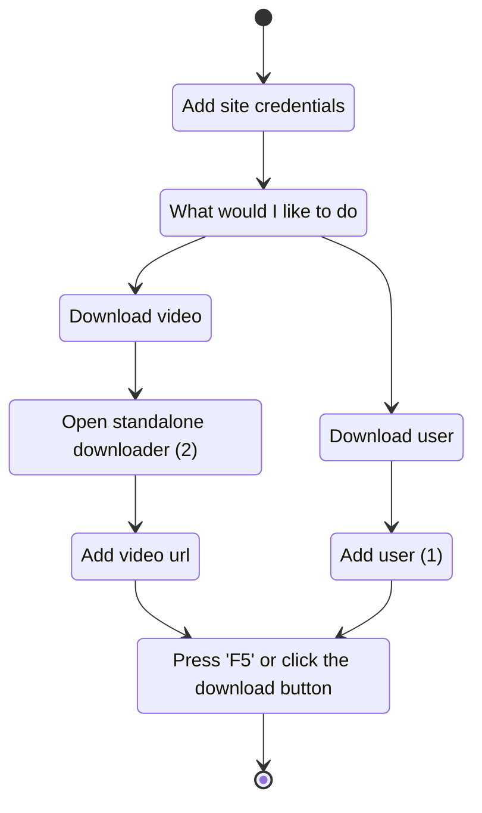

# AAndyProgram/SCrawler

🏳️‍🌈 Media downloader from any sites, including Twitter, Reddit, Instagram, BlueSky, TikTok, Threads, Facebook, OnlyFans, YouTube, Pinterest, PornHub, XHamster, XVIDEOS, ThisVid etc.

## requirements

- **Windows 10, 11** with NET Framework 4.6.1 or higher (v4.6.1 must be installed). You can check version compatibility with this [tool](Tools/NET.FrameworkVersion.ps1).
- **[SITES REQUIREMENTS](https://github.com/AAndyProgram/SCrawler/wiki/Settings#sites-requirements)**

## installation

**Just download the [latest release](https://github.com/AAndyProgram/SCrawler/releases/latest), unzip the program archive to any folder and enjoy.** :blush:

**Don't put program in the `Program Files` system folder (this is portable program and program settings are stored in the program folder)**

**I highly doubt you can run SCrawler on Linux or Mac. SCrawler is a program that is heavily dependent on Windows.**

## tools

The program has an intuitive interface.

**[SITES REQUIREMENTS](https://github.com/AAndyProgram/SCrawler/wiki/Settings#sites-requirements)**

Just add a user profile and **click the `Download` button**.

1. Press `Insert` or click the `Download` button ([read more here](https://github.com/AAndyProgram/SCrawler/wiki#users-list), [hot keys](https://github.com/AAndyProgram/SCrawler/wiki#hot-keys))
2. Click the `Download` button, then `Standalone downloader` ([read more here](https://github.com/AAndyProgram/SCrawler/wiki#download-separate-video))

