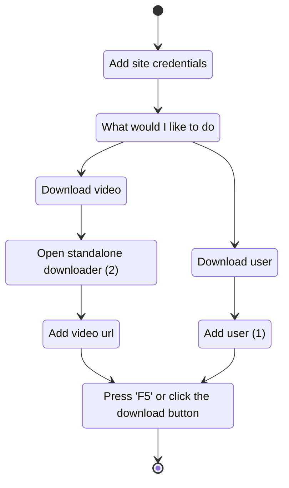

# AAndyProgram/SCrawler

🏳️‍🌈 Media downloader from any sites, including Twitter, Reddit, Instagram, BlueSky, TikTok, Threads, Facebook, OnlyFans, YouTube, Pinterest, PornHub, XHamster, XVIDEOS, ThisVid etc.

## requirements

- **Windows 10, 11** with NET Framework 4.6.1 or higher (v4.6.1 must be installed). You can check version compatibility with this [tool](Tools/NET.FrameworkVersion.ps1).
- **[SITES REQUIREMENTS](https://github.com/AAndyProgram/SCrawler/wiki/Settings#sites-requirements)**

# Guide

- [Main window](https://github.com/AAndyProgram/SCrawler/wiki)
  - [Users](https://github.com/AAndyProgram/SCrawler/wiki/Users)
    - [Add/Edit/Delete users](https://github.com/AAndyProgram/SCrawler/wiki/Users)
    - [Collections](https://github.com/AAndyProgram/SCrawler/wiki#collections)
    - [User operations](https://github.com/AAndyProgram/SCrawler/wiki#context-menu)
    - [User labels](https://github.com/AAndyProgram/SCrawler/wiki/Users#labels)
  - **[DOWNLOAD](https://github.com/AAndyProgram/SCrawler/wiki#download)**
    - [Automation](https://github.com/AAndyProgram/SCrawler/wiki/Settings#automation)
    - [Download groups](https://github.com/AAndyProgram/SCrawler/wiki/Settings#download-groups)
  - [Downloading information](https://github.com/AAndyProgram/SCrawler/wiki#info)
  - [Reddit channels](https://github.com/AAndyProgram/SCrawler/wiki/Channels)
  - [Saved posts](https://github.com/AAndyProgram/SCrawler/wiki#saved-posts)
  - [View modes, filters](https://github.com/AAndyProgram/SCrawler/wiki#view)
- **[SETTINGS](https://github.com/AAndyProgram/SCrawler/wiki/Settings)**
  - **[SITES REQUIREMENTS](https://github.com/AAndyProgram/SCrawler/wiki/Settings#sites-requirements)**
  - [Reddit](https://github.com/AAndyProgram/SCrawler/wiki/Settings#reddit)
  - [Twitter](https://github.com/AAndyProgram/SCrawler/wiki/Settings#twitter)
  - [Bluesky](https://github.com/AAndyProgram/SCrawler/wiki/Settings#bluesky)
  - [OnlyFans](https://github.com/AAndyProgram/SCrawler/wiki/Settings#onlyfans)
  - [Mastodon](https://github.com/AAndyProgram/SCrawler/wiki/Settings#mastodon)
  - [Instagram](https://github.com/AAndyProgram/SCrawler/wiki/Settings#instagram)
  - [Threads](https://github.com/AAndyProgram/SCrawler/wiki/Settings#threads)
  - [Facebook](https://github.com/AAndyProgram/SCrawler/wiki/Settings#facebook)
  - [JustForFans](https://github.com/AAndyProgram/SCrawler/wiki/Settings#justforfans)
  - [TikTok](https://github.com/AAndyProgram/SCrawler/wiki/Settings#tiktok)
  - [RedGifs](https://github.com/AAndyProgram/SCrawler/wiki/Settings#redgifs)
  - [YouTube](https://github.com/AAndyProgram/SCrawler/wiki/Settings#youtube)
  - [Pinterest](https://github.com/AAndyProgram/SCrawler/wiki/Settings#Pinterest)
  - [PornHub](https://github.com/AAndyProgram/SCrawler/wiki/Settings#pornhub)
  - [XHamster](https://github.com/AAndyProgram/SCrawler/wiki/Settings#xhamster)
  - [XVIDEOS](https://github.com/AAndyProgram/SCrawler/wiki/Settings#xvideos)
  - [ThisVid](https://github.com/AAndyProgram/SCrawler/wiki/Settings#thisvid)
  - [LPSG](https://github.com/AAndyProgram/SCrawler/wiki/Settings#lpsg)

**Full guide you can find [here](https://github.com/AAndyProgram/SCrawler/wiki)**

**Video on how to configure**

## installation

**Just download the [latest release](https://github.com/AAndyProgram/SCrawler/releases/latest), unzip the program archive to any folder and enjoy.** :blush:

**Don't put program in the `Program Files` system folder (this is portable program and program settings are stored in the program folder)**

**I highly doubt you can run SCrawler on Linux or Mac. SCrawler is a program that is heavily dependent on Windows.**

# Updating

Just download [latest](https://github.com/AAndyProgram/SCrawler/releases/latest) version and unpack it into the program folder. **Before launching a new version, I recommend making a backup copy of the program settings folder and user settings/data files.**

**You can also use the updater included in the release package.**

# [How to report a problem](CONTRIBUTING.md#how-to-report-a-problem)

# [How to build from source](CONTRIBUTING.md#how-to-build-from-source)

# [How to make a plugin](https://github.com/AAndyProgram/SCrawler/wiki/Plugins)

# [How to support](HowToSupport.md)

## tools

The program has an intuitive interface.

**[SITES REQUIREMENTS](https://github.com/AAndyProgram/SCrawler/wiki/Settings#sites-requirements)**

Just add a user profile and **click the `Download` button**.

1. Press `Insert` or click the `Download` button ([read more here](https://github.com/AAndyProgram/SCrawler/wiki#users-list), [hot keys](https://github.com/AAndyProgram/SCrawler/wiki#hot-keys))
2. Click the `Download` button, then `Standalone downloader` ([read more here](https://github.com/AAndyProgram/SCrawler/wiki#download-separate-video))

# Contact me

Discord server: https://discord.gg/uFNUXvFFmg

[^1]: Partial support means that I don't have personal accounts on paid porn sites because I don't pay for porn. If this site has stopped downloading and you want me to fix it, please be ready to give me access to an account with at least one active subscription. Otherwise, the download from this site will not be fixed.
