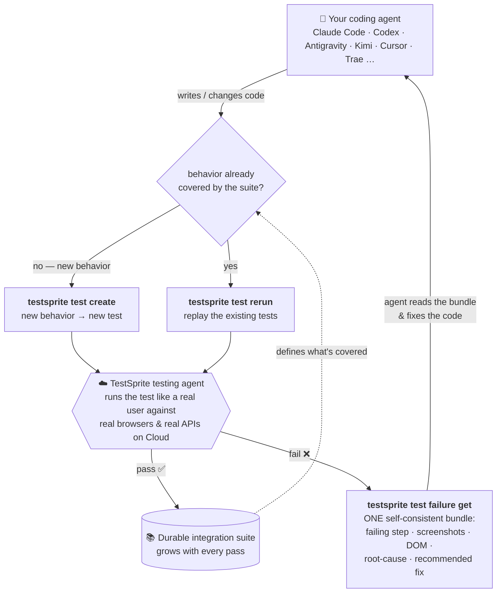

# TestSprite/testsprite-cli

Official TestSprite CLI — AI-powered automated testing from your terminal

## installation

Requires **Node.js 20.19+**, **22.13+**, or **24+**. (No global install? `npx @testsprite/testsprite-cli` works too.)

```bash
npm install -g @testsprite/testsprite-cli
testsprite setup
```

`testsprite setup` prompts for your [API key](https://www.testsprite.com), verifies it, and installs the verification-loop skill for your coding agent (`claude`, `cursor`, `cline`, `windsurf`, `antigravity`, `codex`, etc.) — one command, so your agent is wired to verify its own work. Non-interactive (CI / onboarding scripts):

```bash
TESTSPRITE_API_KEY=sk-... testsprite setup --from-env --yes --agent claude
```

> **Pointing a coding agent (Claude Code, Cursor, Codex, Cline, …) at TestSprite?** Have it run `testsprite setup` first — that installs the verification skill, so the agent knows how to create, run, and triage tests on its own (instead of guessing from this README). New here? Start with the **[getting-started overview](https://docs.testsprite.com/cli/getting-started/overview)**.

> **Privacy note:** interactive runs check the npm registry at most once per 24 h to offer a "new version available" notice — package name only, never your key or data; `TESTSPRITE_NO_UPDATE_NOTIFIER=1` disables it. The backend also advertises its minimum supported CLI version — a below-floor CLI prints a one-line upgrade advisory on stderr, and a too-old client may be rejected with exit 14 (`CLIENT_TOO_OLD`). Details in [DOCUMENTATION.md → Update notice](./DOCUMENTATION.md#update-notice).

From there, the loop runs on its own — an example session, typed by the coding agent:

```bash
# 1 — describe the behavior you want to guarantee, run it, wait
testsprite test create --project proj_8f0f6 --type frontend \
  --plan-from ./checkout-flow.plan.json --run --wait --output json
#   → exits 1: the run failed

# 2 — pull ONE self-consistent failure bundle
testsprite test failure get test_3a9f21c7 --out ./.testsprite/failure

# 3 — the agent reads the bundle, fixes the code, then replays
testsprite test rerun test_3a9f21c7 --wait --output json
#   → exits 0: passed. The test now lives in your durable suite.
```

`./checkout-flow.plan.json` (the `--plan-from` argument above) is a JSON file describing the test in plain language — no browser code required. This is the exact, byte-identical output of `testsprite test create --plan-template` (also embedded verbatim in `test create --help`):

```json
{
  "$schema": "https://raw.githubusercontent.com/TestSprite/testsprite-cli/v0.4.0/schemas/plan.schema.json",
  "projectId": "prj_abc123",
  "type": "frontend",
  "name": "Login rejects an empty password",
  "planSteps": [
    {
      "type": "action",
      "description": "Navigate to /login and submit the form with an empty password"
    },
    {
      "type": "assertion",
      "description": "Verify an inline error says the password is required"
    }
  ]
}
```

Get this exact skeleton without hand-copying it (and without the risk of it drifting from your installed version — see below): `testsprite test create --plan-template`. Full field reference (including the `{{...}}`-placeholder caveat, size caps, and the `$schema` hook for live editor validation): [Plan file format](./DOCUMENTATION.md#plan-file-format).

> The `$schema` URL above is pinned to the CLI version that generated this doc (`v0.4.0`) — `--plan-template`'s live output always pins to **your installed version** instead, which is what actually resolves. If you're reading this on a later release, run the command yourself rather than trusting this snippet verbatim.

Prefer to configure each step by hand (or learn the surface offline with `--dry-run` first)? See [Manual setup](./DOCUMENTATION.md#manual-setup) and [Install & verify](./DOCUMENTATION.md#install--verify).

## tools

| Group          | Command                                                    | What it does                                                                                                                                          |
| -------------- | ---------------------------------------------------------- | ----------------------------------------------------------------------------------------------------------------------------------------------------- |
| **Setup**      | `setup`                                                    | **Start here** — one command: configure your API key, verify it, and install the agent verification skill                                             |
|                | `doctor`                                                   | Environment diagnostic — CLI/Node versions, profile, endpoint, credentials, connectivity, agent skill; exits non-zero on failure                      |
| **Auth**       | `auth status`                                              | Resolve the active profile to its user, key, env, and scopes                                                                                          |
|                | `auth remove`                                              | Remove the active profile from the credentials file                                                                                                   |
|                | `usage` (alias `credits`)                                  | Account pre-flight: identity, plus credit balance / plan info when the backend supplies them                                                          |
| **Read**       | `project list` / `project get`                             | List projects / fetch one by id                                                                                                                       |
|                | `test list` / `test get`                                   | List tests under a project / fetch one by id                                                                                                          |
|                | `test code get`                                            | Print (or write) the generated test source                                                                                                            |
|                | `test steps`                                               | List the latest run's steps with screenshot / DOM pointers                                                                                            |
|                | `test result`                                              | Latest result; `--history` lists a test's prior runs                                                                                                  |
|                | `test failure get`                                         | The agent entry point: one self-contained latest-failure bundle                                                                                       |
|                | `test failure summary`                                     | One-screen triage card (no media download)                                                                                                            |
|                | `test diff`                                                | Compare two runs — verdict, failure kind, per-step status flips, code-version drift                                                                   |
| **Write**      | `test scaffold` / `test lint`                              | Author plans locally: emit a schema-correct starter, validate plan files offline — no network, no credentials                                         |
|                | `test create` / `test create-batch`                        | Create a test (or bulk-create from a plan file); `--produces` / `--needs` / `--category` wire BE dependency metadata                                  |
|                | `test update` / `test delete` / `test

## features

- 🧪 **Tests like a real user.** Runs against a live browser or API in the cloud — real clicks, real navigation, real assertions. Not a mock.
- 🤖 **Agent-shaped output.** `test failure get` returns **one bundle** — the failing step, its neighbors, screenshots, DOM snapshots, the test source, a root-cause hypothesis, and a recommended fix target — all sharing a single `snapshotId`. The CLI _refuses_ to stitch data from two different runs, so an agent never reasons over a frankenstein context.
- ♻️ **A loop, not a one-shot.** `create → run → failure get → fix → rerun` — every pass is banked, not thrown away.
- 📐 **Scriptable & deterministic.** Stable `--output json` contract, predictable [exit codes](./DOCUMENTATION.md#exit-codes), and a `--dry-run` that exercises the full code path offline with canned data.
- 🚦 **CI-native.** On GitHub Actions, `--wait` runs annotate the PR checks tab with one `::error::` per failure and append a results table to the job summary — automatically. Add `--report junit` for a JUnit XML sidecar, `--summary-file` for a machine summary, or `--gh-output` to preview the annotations locally. [Details →](./DOCUMENTATION.md#run-commands)
- 🔌 **One command to onboard your agent.** `testsprite agent install claude` drops a ready-made skill file into your repo so your coding agent knows how to drive the loop on its own.

## How it works

Every time your agent changes code, it asks one question: **is this behavior already covered by the suite?**

- **Not yet covered** → `testsprite test create` — describe the new behavior, run it.
- **Already covered** → `testsprite test rerun` — replay the existing tests, so nothing that used to work breaks silently.
- **Something fails** → `testsprite test failure get` — one self-consistent bundle; the agent fixes the code and reruns.

Every pass is banked into a durable suite, so coverage compounds as the project grows — a lasting record of every requirement it has ever gotten right, far bigger than any context window.



The cloud is a black box on purpose: your agent describes intent and reads results. It never has to know _how_ the test was driven — only _what_ a real user experienced.

## Proved in public

On [**CoderCup**](https://codercup.ai) — an open leaderboard where frontier coding agents build the _same_ app under the _same_ rules, with TestSprite as the referee — the **cheapest** model in the field shipped the **most correct** app on the board: **89%**, at half the cost of the priciest one.

That's the point of all of this: you no longer need the biggest, most expensive model to ship software you can trust — top-tier quality, without paying top-tier prices, within reach of every team.

## Getting help

- 📚 **CLI reference** — [DOCUMENTATION.md](./DOCUMENTATION.md)
- 🌐 **Platform docs** — [testsprite.com/docs](https://www.testsprite.com/docs)
- 🐛 **Issues & feature requests** — [GitHub issues](https://github.com/TestSprite/testsprite-cli/issues)
- 💬 **Quick questions** — [Discord](https://discord.gg/W4JDrZfdB), or `testsprite --help` / `testsprite test run --help` right in your termina
