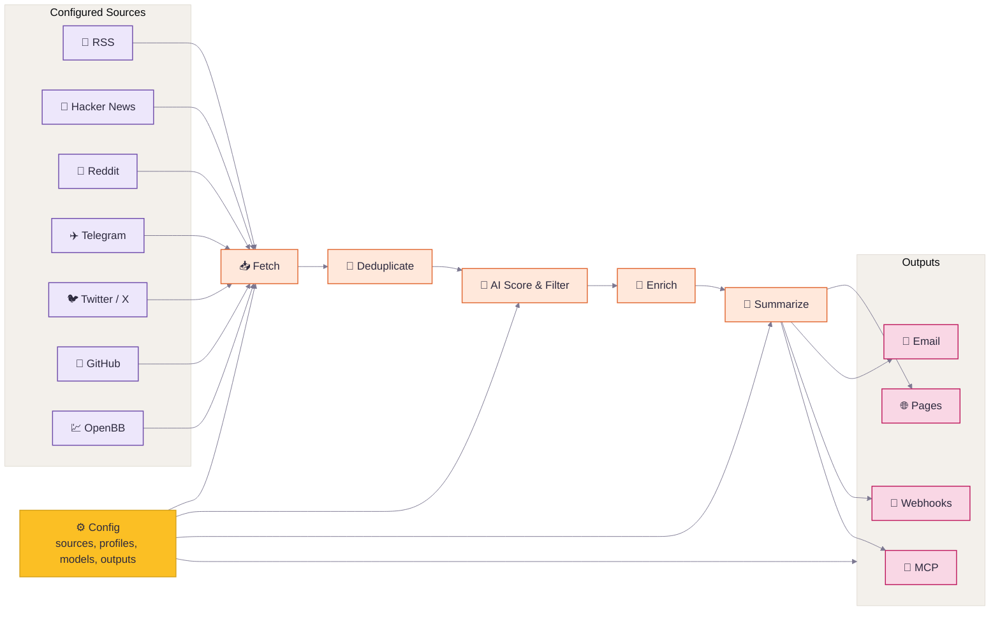

# Thysrael/Horizon

📡 Your own AI-powered news radar. Generates daily briefings in English & Chinese. / 用 AI 构建你专属的新闻雷达

## features

Good news is scattered; bad news is endless. Horizon gives you a personal first pass over Hacker News, Reddit, Telegram, RSS, and GitHub: it fetches, deduplicates, scores, filters, and enriches stories with background context and community discussion.

But Horizon is not just another summarizer. AI is great at reducing noise, but news still needs human taste: the sources you trust, the comments that change how you read a story, and the hidden gems only people can share. Horizon keeps that human layer in the loop with customizable sources, processing profiles, models, languages, delivery channels, comment summaries, and a community source hub.

## Features

- **📡 Watch Your Own Sources** — Track Hacker News, RSS, Reddit, Telegram, Twitter/X, GitHub releases or user activity, and OpenBB financial news watchlists in one pipeline
- **🤖 Turn Noise Into a Reading List** — Analyze each item with a stable processing profile and apply your own filter threshold
- **🔗 Merge Repeated Stories** — Deduplicate the same story across platforms before it reaches your briefing
- **🔍 Understand the Background** — Add web-researched context for unfamiliar concepts, companies, projects, and technical terms
- **💬 Read the Conversation** — Collect and summarize community comments from Hacker News, Reddit, and other supported sources
- **🌐 Publish in Two Languages** — Generate English and Chinese daily briefings from the same source set
- **📝 Ship a Daily Site** — Publish generated Markdown as a GitHub Pages daily briefing site
- **📧 Deliver by Email** — Run a self-hosted SMTP/IMAP newsletter with automatic subscribe and unsubscribe handling
- **🔔 Push to Chat or Automations** — Send templated results to Feishu/Lark, DingTalk, Slack, Discord, or custom webhook endpoints
- **🧙 Start From Your Interests** — Use the setup wizard to generate a personalized source configuration
- **⚙️ Tune the Radar** — Customize sources, processing profiles, models, languages, and delivery channels

## How It Works



1. **Define** — Configure sources, processing profiles, models, languages, and delivery.
2. **Fetch

## installation

### 1. Install

**Option A: Local Installation**

```bash
git clone https://github.com/Thysrael/Horizon.git
cd Horizon

# Install with uv (recommended)
uv sync

# Install test/development extras when needed
uv sync --extra dev

# Or with pip
pip install -e .
```

`dev` is currently defined as an optional extra in `pyproject.toml`, so use `uv sync --extra dev` for pytest and other development dependencies.

If you want the optional OpenBB financial-news source, install its extra too:

```bash
uv sync --extra openbb
```

If `openbb` pulls packages without wheels on your machine, install the SDK manually with binaries only:

```bash
uv pip install --only-binary=:all: openbb openbb-benzinga
```

**Option B: Docker**

```bash
git clone https://github.com/Thysrael/Horizon.git
cd Horizon

# Optional: build with comma-separated extras before the first run
docker compose build --build-arg EXTRAS=trafilatura horizon
```

Multiple extras may be supplied as `EXTRAS=trafilatura,openbb`. The `twitter` extra also requires a Playwright browser and system packages, which the current Dockerfile does not install.

## configuration

**Option A: Interactive wizard (recommended)**

```bash
uv run horizon-wizard
```

The wizard asks about your interests (e.g. "LLM inference", "嵌入式", "web security") and auto-generates `data/config.json`. See [Interactive Wizard](docs/configuration.md#interactive-wizard) for CLI options.

**Option B: Manual configuration**

```bash
cp .env.example .env          # Add your API keys
cp data/config.example.json data/config.json  # Customize your sources
```

Minimal manual configuration:

```jsonc
{
  "ai": {
    "provider": "openai",
    "model": "gpt-4",
    "api_key_env": "OPENAI_API_KEY"
  },
  "sources": {
    "rss": [
      {
        "name": "Simon Willison",
        "url": "https://simonwillison.net/atom/everything/",
        "profile": "tech-news"
      }
    ]
  },
  "processing": {
    "profiles_dir": "profiles",
    "default_profile": "tech-news",
    "profile_settings": {
      "tech-news": {
        "threshold": 7.0,
        "topic_dedup": true
      }
    }
  }
}
```

An explicit source `profile` uses that profile directly. Omit it or set it to
`"auto"` to let AI match the item against all available profiles. Set it to an
array such as `["tech-news", "finance-news"]` to restrict AI matching to those
profiles. See
[Processing Profiles](docs/profiles.md) for profile structure and behavior.
Per-profile user preferences such as score thresholds and topic deduplication
belong in `processing.profile_settings`, not in the profile files.

**Balanced digest (optional)**

Limit the final digest size and prevent one category from dominating the
results. Categories come from source configuration such as
`sources.rss[].category`.

```jsonc
{
  "digest": {
    "max_items": 20,
    "category_groups": {
      "ai": {
        "limit": 5,
        "categories": ["ai-news", "ai-tools", "machine-learning"]
      },
      "finance": {
        "limit": 5,
        "categories": ["finance", "business", "equities"]
      }
    },
    "default_group": "other",
    "default_group_limit": 3
  }
}
```

Group limits are applied after profile filtering and before enrichment. If
`category_groups` and `max_items` are omitted, no balanced digest limits apply.

`api_key_env` must be the name of an environment variable, not the API key
itself. Put the real secret in `.env`:

```bash
OPENAI_API_KEY=sk-your-key
```

For Gemini, use `GOOGLE_API_KEY`:

```jsonc
{
  "ai": {
    "provider": "gemini",
    "model": "gemini-2.0-flash",
    "api_key_env": "GOOGLE_API_KEY"
  }
}
```

Any string value in `data/config.json` can reference environment variables with `${VAR_NAME}`. This is useful for values such as `ai.base_url`, private RSS feed URLs, webhook endpoints, or custom header templates.

For the full reference, see the [Configuration Guide](docs/configuration.md).

### 3. Run

**A. Local installation**

```bash
uv run horizon [OPTIONS]
```

**B. Docker**

```bash
docker compose run --rm horizon [OPTIONS]
```

| Option | Default | Description |
|--------|---------|-------------|
| `--hours N` | 24 | Fetch from last N hours |
| `-d`, `--data-dir PATH` | `data` | Path to the data directory |
| `-c`, `--config PATH` | `<data-dir>/config.json` | Path to config file |
| `-l`, `--log-level LEVEL` | `WARNING` | Logging level (DEBUG/INFO/WARNING/ERROR/CRITICAL) |

`--data-dir` changes the state directory, including summaries, subscribers, and the default config location; `--config` changes only the config file. The generated report is saved to `data/summaries/` (or `<data-dir>/summaries/` if `--data-dir` is set). See [Configuration Paths](docs/configuration.md#configuration-paths) for combining both flags and initializing a custom config location.

### 4. Automate (Optional)

Horizon works great as a **GitHub Actions** cron job. See [`.github/workflows/daily-summary.yml`](.github/workflows/daily-summary.yml) for a ready-to-use workflow that generates and deploys your daily briefing to GitHub Pages automatically.

## Supported Sources

| Source | What it fetches | C
