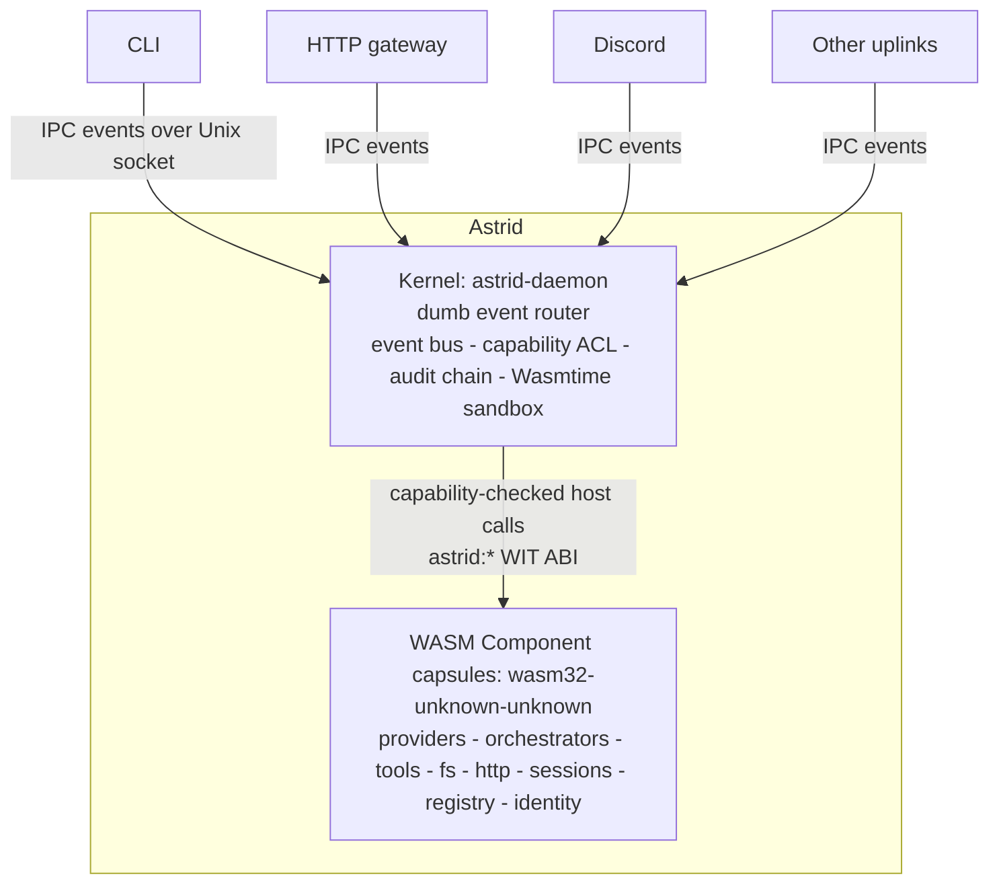

# astrid-runtime/astrid

Astrid is a portable, capability-secure operating system for composable software.

## installation

```bash
brew tap astrid-runtime/tap && brew install astrid
astrid init --distro @yourorg/your-distro
astrid start
astrid status
astrid capsule list
```

Astrid Runtime does not select or bundle a product distro. Choose a distro you
trust and pass its name, repository, local `Distro.toml`, or signed `.shuttle`
archive explicitly with `--distro`. Operators running an uncomposed runtime can
skip `init` and start the daemon directly.

Start with [the Book](https://github.com/astrid-runtime/book) for the
architecture or the [Contributor Handbook](https://github.com/astrid-runtime/handbook)
to contribute.

## features

Agent frameworks put trust in the prompt. Astrid puts it in the runtime. An agent is untrusted code
executing on your machine with access to your files, your network, and your credentials. Telling it
to behave is not a security boundary. An OS-grade boundary is.

- **Cryptographic capability model.** Every file path, network host, and tool is a signed ed25519
  grant scoped to a resource pattern, principal-bound, expiry-checked, and globally revocable. No
  grant, no access.
- **WASM sandbox with no ambient authority.** Capsules run in Wasmtime with no syscalls, no file
  descriptors, and no host memory. Every external effect is a capability-checked host call over a
  WIT-typed ABI.
- **The kernel is dumb.** It instantiates an event bus, loads capsules, and routes IPC bytes under a
  capability ACL. It has no LLM handles, no conversation state, and no tool registry. All
  intelligence lives in capsules, so a capsule bug cannot corrupt shared kernel state.
- **Per-principal everything.** Each identity gets isolated capsule access, KV data, secrets, home
  directory, quotas, and audit chain. One principal can never read another's namespace, and it fails
  closed if the caller cannot be resolved.
- **Signed, hash-linked audit chain.** Each entry seals the hash of the one before it and is signed.
  Break the chain and the tampering shows.
- **Live capsule lifecycle.** Install, upgrade, and remove capsules on a running daemon. No restart.

## How it works

Frontends (the CLI, the HTTP gateway, Discord, and so on) are **uplinks**: protocol clients that
connect to the daemon over a Unix domain socket and speak in IPC events. There is no `Frontend`
trait. An uplink publishes events and receives responses like any other bus participant.



Capsules communicate exclusively through the bus. Each declares what it needs and what it provides
in a `Capsule.toml` manifest with typed `[imports]`/`[exports]` tables; the kernel resolves the
dependency graph by topological sort and boots capsules in order. Tools are an IPC convention, not a
kernel concept: a tool capsule intercepts `tool.v1.execute.<name>`, and the kernel never sees a tool
schema.

The host ABI is the WebAssembly component model with versioned `astrid:*` WIT packages:
`fs`, `io`, `kv`, `ipc`, `net`, `http`, `sys`, `process`, `approval`, `identity`, `elicit`, and
`uplink`. Guests import only what their manifest allows, and every call is capability-gated at the
boundary.

## The security model

Astrid's security is decomposed. There is no single gate every action funnels through. A capsule has
no ambient authority, and authorization is enforced by independent, per-area mechanisms, each
fail-closed and each enforced where the effect actually happens.

```mermaid
flowchart TB
    Action[A capsule action] --> Sandbox[WASM sandbox<br/>no syscalls, file descriptors, or host memory<br/>external resources are capability-checked host calls]
    Action --> Manifest[Manifest gate<br/>declared file, network, and process allow-list<br/>empty is deny-all; path traversal and SSRF defenses]
    Action --> IPC[IPC ACL<br/>declared publish and subscribe topics only<br/>per-principal routing]
    Action --> Capability[Capability token<br/>ed25519, principal-bound, scoped, expiring, revocable<br/>per-device tokens can be subset-scoped]
    Action --> Approval[Approval gate<br/>once - session - always - d
