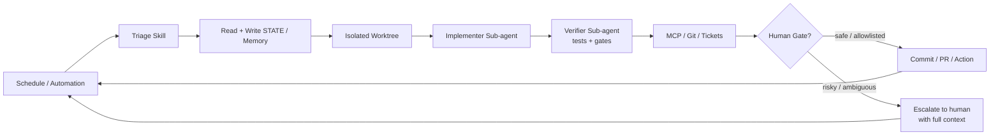

# cobusgreyling/loop-engineering

Practical patterns, starters & CLI tools for loop engineering with AI coding agents. Design systems that prompt and orchestrate agents (inspired by Addy Osmani and Boris Cherny). Includes loop-audit, 

## features

Peter Steinberger:
> “You shouldn’t be prompting coding agents anymore. You should be designing loops that prompt your agents.”

Boris Cherny (Head of Claude Code at Anthropic):
> “I don’t prompt Claude anymore. I have loops running that prompt Claude and figuring out what to do. My job is to write loops.”

The leverage point has moved from crafting individual prompts to designing the control systems that orchestrate agents over time.

## The Five Building Blocks + Memory

| Primitive | Job in the Loop |
|-----------|-----------------|
| **Automations / Scheduling** | Discovery + triage on a cadence |
| **Worktrees** | Safe parallel execution |
| **Skills** | Persistent project knowledge |
| **Plugins & Connectors** | Reach into your real tools (MCP) |
| **Sub-agents** | Maker / checker split |
| **+ Memory / State** | Durable spine outside any conversation |

Full detail: [docs/primitives.md](docs/primitives.md) · Cross-tool matrix: [docs/primitives-matrix.md](docs/primitives-matrix.md)

### Visual Overview

<p align="center">
  
</p>

### Anatomy of a Loop

<p align="center">
  
</p>

<details>
<summary>Mermaid diagram (copy-friendly)</summary>



</details>

Deeper diagrams — the actor-level sequence within one run, the run lifecycle's states, autonomy levels L1-L3, and how `tools/` maps onto the primitives — live in [docs/architecture-diagrams.md](docs/architecture-diagrams.md).

**This reference repo now runs its own `validate-patterns` + `audit` workflows on every push/PR** (see `.github/workflows/`). We also added `LOOP.md` describing the loops that will maintain it.

## Patterns

<p align="center">
  
</p>

| Pattern | Cadence | Starter | Week 1 | Token cost |
|---------|---------|---------|--------|------------|
| [Daily Triage](patterns/daily-triage.md) | 1d–2h | [minimal-loop](starters/minimal-loop/) | **L1** report | Low |
| [PR Babysitter](patterns/pr-babysitter.md) | 5–15m | [pr-babysitter](starters/pr-babysitter/) | L1 watch | High |
| [CI Sweeper](patterns/ci-sweeper.md) | 5–15m | [ci-sweeper](starters/ci-sweeper/) | L2 cautious | Very high |
| [Dependency Sweeper](patterns/dependency-sweeper.md) | 6h–1d | [dependency-sweeper](starters/dependency-sweeper/) | L2 patch-only | Medium |
| [Changelog Drafter](patterns/changelog-drafter.md) | 1d or tag | [changelog-drafter](starters/changelog-drafter/) | **L1** draft | Low |
| [Post-Merge Cleanup](patterns/post-merge-cleanup.md) | 1d–6h | [post-merge-cleanup](starters/post-merge-cleanup/) | **L1** off-peak | Low |
| [Issue Triage](patterns/issue-triage.md) | 2h–1d | [issue-triage](starters/issue-triage/) | **L1** propose-only | Low |

Not sure which to pick? Try the [interactive picker](https://cobusgreyling.github.io/loop-engineering/#interactive) or [pattern-picker](docs/pattern-picker.md).

Machine-readable index: [patterns/registry.yaml](patterns/registry.yaml) (7 patterns)

## installation

```bash
# 1. Scaffold + Loop Ready score (printed automatically)
npx @cobusgreyling/loop init . --pattern daily-triage --tool grok

# 2. One health check (audit + sync + files → top 3 actions)
npx @cobusgreyling/loop doctor .

# 3. Optional: cost estimate / badge / day-2 dashboard
npx @cobusgreyling/loop cost --pattern daily-triage --level L1
npx @cobusgreyling/loop badge .
npx @cobusgreyling/loop status .

# 4. See scores climb: empty → L1 → L2
bash scripts/before-after-demo.sh

# 5. Start report-only (Grok example)
/loop 1d Run loop-triage. Update STATE.md. No auto-fix in week one.
```

**Same as before:** `npx @cobusgreyling/loop-init` and `loop-audit` still work — [CLI front door](docs/cli-front-door.md).

All npm CLIs publish from tagged releases — see [docs/RELEASE.md](docs/RELEASE.md). No clone required.

**Develop from source** (monorepo contributors):

```bash
cd tools/loop && npm ci && npm test && node dist/cli.js doctor ../..
cd tools/loop-init && npm ci && npm test && node dist/cli.js /path/to/project --pattern daily-triage --tool grok
cd tools/loop-audit && npm ci && npm test && node dist/cli.js /path/to/project --suggest
cd tools/loop-cost && npm ci && npm test && node dist/cli.js --pattern ci-sweeper --cadence 15m
```

Phased rollout: **L1 report → L2 assisted fixes → L3 unattended** — see [loop-design-checklist](docs/loop-design-checklist.md).

## tools

- [Grok](examples/grok/daily-triage.md)
- [Claude Code](examples/claude-code/)
- [Codex](examples/codex/)
- [OpenClaw](examples/openclaw/daily-triage.md)
- [Opencode](examples/opencode/)
- [GitHub Actions](examples/github-actions/)

## Operating & Safety

- [Failure Modes](docs/failure-modes.md) — incident-style catalog
- [Anti-Patterns](docs/anti-patterns.md) — design mistakes before production
- [Multi-Loop Coordination](docs/multi-loop.md) — when loops collide
- [Operating Loops](docs/operating-loops.md) — cost, logging, when to kill
- [Safety](docs/safety.md) — denylist, auto-merge, MCP scopes
- [Security](SECURITY.md) — reporting and unattended automation risks
- [Concepts](docs/concepts.md) — intent debt, comprehension debt, harness vs loop
- [MCP Cookbook](examples/mcp/) — connector examples by pattern

## limitations

Loop engineering amplifies judgment — both good and bad.

- **Token costs** can explode with sub-agents and long-running loops.
- **Verification is still on you.** Unattended loops make unattended mistakes.
- **Comprehension debt** grows faster unless you read what the loop ships.
- Two people can run the same loop and get opposite results. The loop doesn't know. You do.

Addy Osmani:
> “Build the loop. But build it like someone who intends to stay the engineer, not just the person who presses go.”

## Help wanted

**First PR?** Pick an open issue below, or [Add Adopter](https://github.com/cobusgreyling/loop-engineering/issues/new?template=add-adopter.yml) / [Share a story](https://github.com/cobusgreyling/loop-engineering/issues/new?template=share-story.yml).

**Review SLA:** docs, stories, adopters, and small tests — **within 48 hours** (same-day when possible). See [CONTRIBUTORS.md](CONTRIBUTORS.md) and the [contributor quickstart](https://github.com/cobusgreyling/loop-engineering/discussions/123).

[`good first issue` backlog](https://github.com/cobusgreyling/loop-engineering/issues?q=is%3Aissue+is%3Aopen+label%3A%22good+first+issue%22) (comment **"I'll take this"** for assignment). Prefer the live filter if a row below looks stale.

| Time | Issue | What you ship |
|------|-------|---------------|
| ~10 min | [#120 — Adopters list](https://github.com/cobusgreyling/loop-engineering/issues/120) | One row in `docs/adopters.md` (or [Add Adopter](https://github.com/cobusgreyling/loop-engineering/issues/new?template=add-adopter.yml) template) |
| ~15–20 min | [#118 — Daily Triage story](https://github.com/cobusgreyling/loop-engineering/issues/118) · [#173 — Issue Triage story](https://github.com/cobusgreyling/loop-engineering/issues/173) · [#119 — PR Babysitter failure](https://github.com/cobusgreyling/loop-engineering/issues/119) | Honest `stories/` write-up + index row |
| ~40–45 min | [#388 — Hermes Issue Triage](https://github.com/cobusgreyling/loop-engineering/issues/388) | Hermes Issue Triage example in `examples/hermes/` |
| Anytime | Templates | [Add Adopter](https://github.com/cobusgreyling/loop-engineering/issues/new?template=add-adopter.yml) · [Share a story](https://github.com/cobusgreyling/loop-engineering/issues/new?template=share-story.yml) |
| Hubs | Discussions | [Show your loop](https://github.com/cobusgreyling/loop-engineering/discussions/326) · [Ask anything](https://github.com/cobusgreyling/loop-engineering/discussions/327) |

**Recently shipped (thanks!):** @AIMindCrafter — Windows/CRLF notes (#492), Windsurf Post-Merge Cleanup (#494), Windsurf Changelog Drafter (#495). @pxmpsdev — loop-sync CRLF tests (#496), readiness skill-dedup (#497), append-run-log invalid-JSON (#498), metrics unparseable run_id (#499). @shixi-li — Hermes CI Sweeper example (#500).

**Docs/examples triage:** @AIMindCrafter co-owns `docs/`, `examples/`, and `stories/` (see [CODEOWNERS](CODEOWNERS) + [docs/area-owners.md](docs/area-owners.md)).

Maintainers re-seed the backlog with `bash scripts/create-good-first-issues.sh` (idempotent; skips existing titles). Prefer [live open GFI filter](https://github.com/cobusgreyling/loop-engineering/issues?q=is%3Aissue+is%3Aopen+label%3A%22good+first+issue%22) over this table if a row looks stale.

## Contributing

Share production patterns, tool mappings, and failure stories. See [CONTRIBUTING.md](CONTRIBUTING.md) (ladder + setup), [Code of Conduct](CODE_OF_CONDUCT.md), [adopters](docs/adopters.md), and hubs: [Show your loop](https://github.com/cobusgreyling/loop-engineering/discussions/326) · [Ask anything](https://github.com/cobusgreyling/loop-engineering/discussions/327).

We aim to **first-respond within 48 hours** on external PRs. Start here: [`good first issue`](https://github.com/cobusgreyling/loop-engineering/issues?q=is%3Aissue+is%3Aopen+label%3A%22good+first+issue%22) · [Help wanted](#help-wanted).

## Sources

- [Cobus Greyling – Loop Engineering (Substack)](https://cobusgreyling.subs
