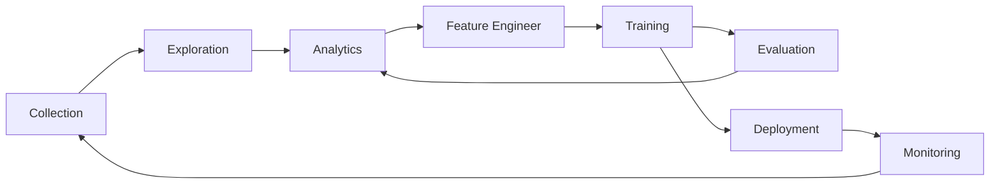

# lance-format/lance

Open Lakehouse Format for Multimodal AI. Convert from Parquet in 2 lines of code for 100x faster random access, vector index, and data versioning. Compatible with Pandas, DuckDB, Polars, Pyarrow, and 

## installation

**Installation**

```shell
pip install pylance
```

To install a preview release:

```shell
pip install --pre --extra-index-url https://pypi.fury.io/lance-format pylance
```

> [!TIP]
> Preview releases are released more often than full releases and contain the
> latest features and bug fixes. They receive the same level of testing as full releases.
> We guarantee they will remain published and available for download for at
> least 6 months. When you want to pin to a specific version, prefer a stable release.

**Converting to Lance**

```python
import lance

import pandas as pd
import pyarrow as pa
import pyarrow.dataset

df = pd.DataFrame({"a": [5], "b": [10]})
uri = "/tmp/test.parquet"
tbl = pa.Table.from_pandas(df)
pa.dataset.write_dataset(tbl, uri, format='parquet')

parquet = pa.dataset.dataset(uri, format='parquet')
lance.write_dataset(parquet, "/tmp/test.lance")
```

**Reading Lance data**
```python
dataset = lance.dataset("/tmp/test.lance")
assert isinstance(dataset, pa.dataset.Dataset)
```

**Pandas**
```python
df = dataset.to_table().to_pandas()

## features

The machine learning development cycle involves multiple stages:



Traditional lakehouse formats were designed for SQL analytics and struggle with AI/ML workloads that require:
- **Vector search** for similarity and semantic retrieval
- **Fast random access** for sampling and interactive exploration
- **Multimodal data** storage (images, videos, audio alongside embeddings)
- **Data evolution** for feature engineering without full table rewrites
- **Hybrid search** combining vectors, full-text, and SQL predicates

While existing formats (Parquet, Iceberg, Delta Lake) excel at SQL analytics, they require additional specialized systems for AI capabilities. Lance brings these AI-first features directly into the lakehouse format.

A comparison of different formats across ML development stages:

|                     | Lance | Parquet & ORC | JSON & XML | TFRecord | Database | Warehouse |
|---------------------|-------|---------------|------------|----------|----------|-----------|
| Analytics           | Fast  | Fast          | Slow       | Slow     | Decent   | Fast      |
| Feature Engineering | Fast  | Fast          | Decent     | Slow     | Decent   | Good      |
| Training            | Fast  | Decent        | Slow       | Fast     | N/A      | N/A       |
| Exploration         | Fast  | Slow          | Fast       | Slow     | Fast     | Decent    |
| Infra Support       | Rich  | Rich          | Decent     | Limited  | Rich     | Rich      |
