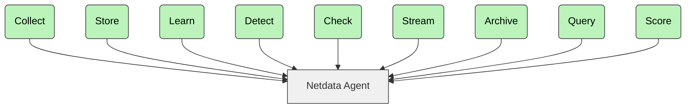

# netdata/netdata

The fastest path to AI-powered full stack observability, even for lean teams.

## features

| Feature                    | Description                               | What Makes It Unique                                     |
|----------------------------|-------------------------------------------|----------------------------------------------------------|
| **Real-Time**              | Per-second data collection and processing | Works in a beat – click and see results instantly        |
| **Zero-Configuration**     | Automatic detection and discovery         | Auto-discovers everything on the nodes it runs           |
| **ML-Powered**             | Unsupervised anomaly detection            | Trains multiple ML models per metric at the edge         |
| **Long-Term Retention**    | High-performance storage                  | ~0.5 bytes per sample with tiered storage for archiving  |
| **Advanced Visualization** | Rich, interactive dashboards              | Slice and dice data without query language               |
| **Extreme Scalability**    | Native horizontal scaling                 | Parent-Child centralization with multi-million samples/s |
| **Complete Visibility**    | From infrastructure to applications       | Simplifies operations and eliminates silos               |
| **Edge-Based**             | Processing at your premises               | Distributes code instead of centralizing data            |

> [!NOTE]  
> Want to put Netdata to the test against Prometheus?
> Explore the [full comparison](https://www.netdata.cloud/blog/netdata-vs-prometheus-2025/).

---

## Netdata Ecosystem

This three-part architecture enables you to scale from single nodes to complex multi-cloud environments:

| Component         | Description                                                                                                                                                 | License                                         |
|-------------------|-------------------------------------------------------------------------------------------------------------------------------------------------------------|-------------------------------------------------|
| **Netdata Agent** | • Core monitoring engine • Handles collection, storage, ML, alerts, exports • Runs on servers, cloud, K8s, IoT • Zero production impact            | [GPL v3+](https://www.gnu.org/licenses/gpl-3.0) |
| **Netdata Cloud** | • Enterprise features • User management, RBAC, horizontal scaling • Centralized alerts • Free community tier • No metric storage centralization |                                                 |
| **Netdata UI**    | • Dashboards and visualizations • Free to use • Included in standard packages • Latest version via CDN                                             | [NCUL1](https://app.netdata.cloud/LICENSE.txt)  |

## What You Can Monitor

With Netdata you can monitor all these components across platforms:

|                                                                                                   Component |              Linux               | FreeBSD | macOS |                      Windows                      |
|------------------------------------------------------------------------------------------------------------:|:--------------------------------:|:-------:|:-----:|:-------------------------------------------------:|
|                             **System Resources**<small> CPU, Memory and system shared resources</small> |               Full               |   Yes   |  Yes  |                        Yes                        |
|                                **Storage**<small> Disks, Mount points, Filesystems, RAID arrays</small> |               Full               |   Yes   |  Yes  |                        Yes                        |
|                                 **Network**<small> Network Interfaces, Protocols, Firewall, etc</small> |               Full               |   Yes   |  Yes  |                        Yes                        |
|                        **Hardware 

## installation

You can install Netdata on all major operating systems. To begin:

### 1. Install Netdata

Choose your platform and follow the installation guide:

* [Linux Installation](https://learn.netdata.cloud/docs/installing/one-line-installer-for-all-linux-systems)
* [macOS](https://learn.netdata.cloud/docs/installing/macos)
* [FreeBSD](https://learn.netdata.cloud/docs/installing/freebsd)
* [Windows](https://learn.netdata.cloud/docs/netdata-agent/installation/windows)
* [Docker Guide](/packaging/docker/README.md)
* [Kubernetes Setup](https://learn.netdata.cloud/docs/installation/install-on-specific-environments/kubernetes)

> [!NOTE]
> You can access the Netdata UI at `http://localhost:19999` (or `http://NODE:19999` if remote).

## configuration

Netdata auto-discovers most metrics, but you can manually configure some collectors:

* [All collectors](https://learn.netdata.cloud/docs/data-collection/)
* [SNMP monitoring](https://learn.netdata.cloud/docs/data-collection/monitor-anything/networking/snmp)

### 3. Configure Alerts

You can use hundreds of built-in alerts and integrate with:

`email`, `Slack`, `Telegram`, `PagerDuty`, `Discord`, `Microsoft Teams`, and more.

> [!NOTE]  
> Email alerts work by default if there's a configured MTA.

### 4. Configure Parents

You can centralize dashboards, alerts, and storage with Netdata Parents:

* [Streaming Reference](https://learn.netdata.cloud/docs/streaming/streaming-configuration-reference)

> [!NOTE]  
> You can use Netdata Parents for central dashboards, longer retention, and alert configuration.

### 5. Connect to Netdata Cloud

[Sign in to Netdata Cloud](https://app.netdata.cloud/sign-in) and connect your nodes for:

* Access from anywhere
* Horizontal scalability and multi-node dashboards
* UI configuration for alerts and data collection
* Role-based access control
* Free tier available

> [!NOTE]  
> Netdata Cloud is optional. Your data stays in your infrastructure.

## Live Demo Sites

  <b>See Netdata in action</b> 
  <a href="https://frankfurt.netdata.rocks"><b>FRANKFURT</b></a> |
  <a href="https://newyork.netdata.rocks"><b>NEWYORK</b></a> |
  <a href="https://atlanta.netdata.rocks"><b>ATLANTA</b></a> |
  <a href="https://sanfrancisco.netdata.rocks"><b>SANFRANCISCO</b></a> |
  <a href="https://toronto.netdata.rocks"><b>TORONTO</b></a> |
  <a href="https://singapore.netdata.rocks"><b>SINGAPORE</b></a> |
  <a href="https://bangalore.netdata.rocks"><b>BANGALORE</b></a>
   
  <i>These demo clusters run with default configuration and show real monitoring data.</i>
   
  <i>Choose the instance closest to you for the best performance.</i>

---

## How It Works

With Netdata you can run a modular pipeline for metrics collection, processing, and visualization.

With each Agent you can:

1. **Collect** – Gather metrics from systems, containers, apps, logs, APIs, and synthetic checks.
2. **Store** – Save metrics to a high-efficiency, tiered time-series database.
3. **Learn** – Train ML models per metric using recent behavior.
4. **Detect** – Identify anomalies using trained ML models.
5. **Check** – Evaluate metrics against pre-set or custom alert rules.
6. **Stream** – Send metrics to Netdata Parents in real time.
7. **Archive** – Export metrics to Prometheus, InfluxDB, OpenTSDB, Graphite, and others.
8. **Query** – Access metrics via an API for dashboards or third-party tools.
9. **Score** – Use a scoring engine to find patterns and correlations across metrics.

> [!NOTE]  
> Learn more: [Netdata's architecture](https://learn.netdata.cloud/docs/netdata-agent/#distributed-observability-pipeline)
