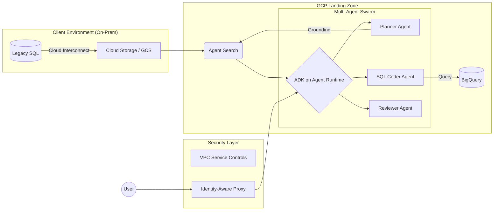

# pierpaolo28/Awesome-FDE-Roadmap

🚀 The definitive roadmap to becoming a Forward Deployment Engineer (FDE). Master AI Agents, Enterprise Data Architecture, and Strategic Consulting. Bridging the gap between HQ and the field. Inspired 

## installation

uvx google-agents-cli setup

# Coding-agent flow: launch Claude Code / Gemini CLI / Codex / Antigravity and prompt it —
#   "Use agents-cli to scaffold a finance agent that summarizes expense reports,
#    deploy it to Agent Runtime, and publish it to Gemini Enterprise."

# Standalone terminal flow (from the Google Developers Blog launch post):
agents-cli create finance-agent -y --deployment-target agent_runtime   # scaffold
cd finance-agent
agents-cli eval run                                                    # run evals
agents-cli eval compare evals/run_v1.json evals/run_v2.json            # compare runs
agents-cli infra single-project                                        # provision GCP infra
agents-cli deploy                                                      # ship to Agent Runtime
agents-cli publish gemini-enterprise                                   # register with Gemini Enterprise
```

Cloud Trace is on by default. Additional observability (service account, GCS bucket, BigQuery dataset for full prompt-response logging) can be provisioned by prompting the coding agent to "set up observability infrastructure."

**Requirements:** Python 3.11+, `uv`, Node.js (for skills install). Optional for deploy: Google Cloud SDK, Terraform. Platform support: macOS, Linux, and Windows (WSL 2 — native Windows not officially supported).

---

### ⚖️ LLM Systems Evaluation (The Success Key)
FDEs don't just "vibes-test" their agents; they use a two-loop evaluation framework to prove reliability to the client.

#### 1. The Inner Loop (Dev-Time Evaluation with ADK)
Focuses on fast, manual, and interactive debugging during development.
*   **`adk eval`:** A CLI and Web UI tool to test execution paths against "Golden Datasets".
*   **Metrics:** `tool_trajectory_avg_score` (Did it use the right tools?), `response_match_score` (ROUGE similarity), and `rubric_based_final_response_quality`.

#### 2. The Outer Loop (Production Evaluation on Agent Platform)
Scalable, automated evaluation for high-volume production data and CI/CD integration. FDEs use this to prove that a model update or a prompt change is a measurable improvement across thousands of test cases.

*   **[Gemini Enterprise Agent Platform Evals](https://docs.cloud.google.com/gemini-enterprise-agent-platform/models/computation-based-eval-pipeline)** (formerly Vertex AI Gen AI Evaluation Service): The unified service for both **Rapid Evaluation** (synchronous, for dev/test) and **Pipeline Evaluation** (asynchronous, for massive datasets).
*   **Pairwise Evaluation (The evolution of AutoSxS):** A "Model-as-a-Judge" approach. It uses a superior model (e.g., Gemini 3 Pro) as an autorater to compare two model responses (Model A vs. Model B) based on a specific rubric, providing win rates and detailed explanations for every "judgment."
*   **Pointwise Evaluation (The RAG Triad):** Assessing single model responses against specific quality dimensions using the **Rapid Eval API**:
    *   **Groundedness:** Does the response strictly follow the retrieved context? (Crucial for eliminating hallucinations).
    *   **Fulfillment:** Did the agent actually follow the instructions in the system prompt?
    *   **Summarization & Coherence:** Evaluating the linguistic quality and density of the output.
*   **[Model Monitoring on Gemini Enterprise Agent Platform](https://docs.cloud.google.com/gemini-enterprise-agent-platform/machine-learning/model-monitoring/overview)** (formerly Vertex AI Model Monitoring): Essential for "Day 2" operations. FDEs set up monitoring to detect **Prediction Drift** and **Feature Attribution** changes in production, ensuring the agentic system doesn't degrade over time as client data evolves.

---

### 🤖 The Enterprise RAG Blueprint
1.  **Ingestion:** Using **[LlamaParse](https://developers.llamaindex.ai/python/framework/llama_cloud/llama_parse/)** to extract data from complex enterprise PDFs/tables.
2.  **Grounding:** Using **[Agent Search on Gemini Enterprise Agent Plat

## features

#### 1. Objective & User Persona
Enable **[User Group, e.g., Risk Analysts]** to perform **[Action, e.g., Fraud Investigation]** by leveraging **[Technology, e.g., Multi-Agent ADK Swarm]**.

#### 2. Definition of Success (The Evals)
*Success is not "it works"; success is measurable:*
- **Retrieval:** >90% Hit Rate on Top-3 documents.
- **Latency:** End-to-end agent reasoning < 5 seconds.
- **Groundedness:** 0% Hallucination rate on Golden Dataset (manually verified by Client).

#### 3. Phased Deployment Strategy
- **Phase 1 (MVP):** Manual trigger agent on Cloud Run using BigQuery static export.
- **Phase 2 (Scale):** Automated trigger via Pub/Sub on real-time data stream.

#### 4. Out of Scope
- Integration with the legacy AS400 mainframe (deferred to Q3).
```

---

### 3. The Agentic Deployment Architecture (GCP)
*A Mermaid/Excalidraw diagram showing a modern, high-scale FDE deployment.*



---

### 4. The Executive Status Report (The "WES")
*The weekly document that justifies the contract renewal.*

```markdown
## 🛰️ Weekly Executive Summary: [Project Name]
**Reporting Period:** [Date Range] | **Status:** 🟢 GREEN

#### 🚀 Value Delivered This Week
- **Metric Move:** Reduced manual data lookup time for Analysts by **40%** via the new Search Agent.
- **Milestone:** Successfully cleared the Security Review for the GKE Private Cluster.
- **Ingestion:** 1.2B rows of historical logs moved into BigQuery; partitioning optimized for cost.

#### ⚠️ Risks & Strategic Blockers
- **Risk:** Client IT team has delayed the Firewall port opening for the VPN.
- **Impact:** Potential 3-day slide on the "Real-time" dashboard milestone.
- **Action Required:** Need [Executive Sponsor Name] to approve the exception ticket #12345.

#### 🗓️ The "Day 30" Horizon
- Finalize **Pairwise Evaluation** run for the production agent.
- Transition 1st-line support to the internal Client Ops team.
```

---

## 📖 Comprehensive Reading List

Being a "Forward" engineer means staying six months ahead of the industry. This list is curated to move you from a "coder" to a "system architect and strategist".

### 📚 The FDE "Canon" (Core Books)
*   📗 **[Designing Data-Intensive Applications](https://www.oreilly.com/library/view/designing-data-intensive-applications/9781491903063/) (Martin Kleppmann):** The "Bible". If you only read one book on this list, make it this one. It explains the *why* behind every database and distributed system you will use on GCP.
*   📘 **[The Trusted Advisor](https://trustedadvisor.com/books/the-trusted-advisor) (David Maister):** FDEs fail more often due to broken trust than broken code. This book teaches you how to move from a "vendor" to a "strategic partner".
*   📙 **[The Pyramid Principle](https://www.amazon.com/Pyramid-Principle-Logic-Writing-Thinking/dp/0273710516) (Barbara Minto):** The McKinsey standard for communication. Learn to lead with the conclusion and support it with data—essential for talking to client executives.
*   📕 **[Enterprise Integration Patterns](https://www.enterpriseintegrationpatterns.com/) (Gregor Hohpe):** Essential for Phase 2. It teaches you how to "glue" legacy systems together using messaging, gateways, and translators.
*   📓 **[Staff Engineer: Leadership beyond the management track](https://staffeng.com/book) (Will Larson):** FDE is often a "Staff-plus" role in terms of scope. This boo
