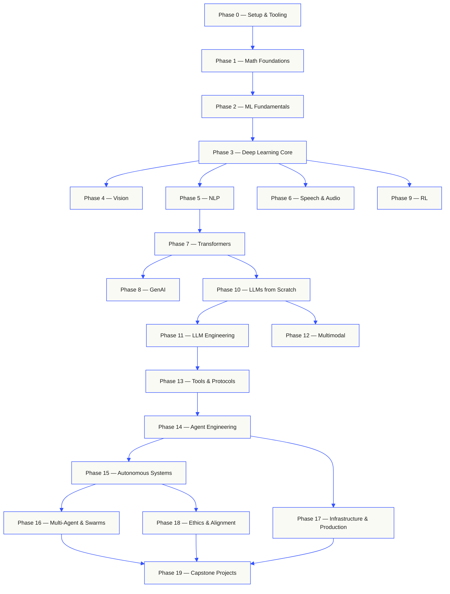

# rohitg00/ai-engineering-from-scratch

Learn it. Build it. Ship it for others.

## requirements

- You can write code (any language; Python helps).
- You want to understand how AI **actually works**, not just call APIs.

## Where to start

| Background | Start at | Estimated time |
|---|---|---|
| New to programming and AI | Phase 0 — Setup | ~306 hours |
| Know Python, new to ML | Phase 1 — Math Foundations | ~270 hours |
| Know ML, new to deep learning | Phase 3 — Deep Learning Core | ~200 hours |
| Know deep learning, want LLMs and agents | Phase 10 — LLMs from Scratch | ~100 hours |
| Senior engineer, only want agent engineering | Phase 14 — Agent Engineering | ~60 hours |
| Only want to build production MCP systems | [Model Context Protocol (MCP) path](learning-paths/model-context-protocol.json) | ~23 hours 15 min |
| Only want to build production Agent Skills | [Agent Skills Engineering path](learning-paths/agent-skills.json) | ~9.5 hours |

## The shape of the curriculum

Twenty phases stack on top of each other. Math is the floor. Agents and production are the roof.
Skip ahead if you already know the lower layers, but don't skip and then wonder why something at
the top is breaking.

## Contents

Twenty phases. Click any phase to expand its lesson list.

## installation

> Get your environment ready for everything that follows.

| # | Lesson | Type | Lang |
|:---:|--------|:----:|------|
| 01 | [Dev Environment](phases/00-setup-and-tooling/01-dev-environment/) | Build | Python |
| 02 | [Git & Collaboration](phases/00-setup-and-tooling/02-git-and-collaboration/) | Learn | — |
| 03 | [GPU Setup & Cloud](phases/00-setup-and-tooling/03-gpu-setup-and-cloud/) | Build | Python |
| 04 | [APIs & Keys](phases/00-setup-and-tooling/04-apis-and-keys/) | Build | Python |
| 05 | [Jupyter Notebooks](phases/00-setup-and-tooling/05-jupyter-notebooks/) | Build | Python |
| 06 | [Python Environments](phases/00-setup-and-tooling/06-python-environments/) | Build | Shell |
| 07 | [Docker for AI](phases/00-setup-and-tooling/07-docker-for-ai/) | Build | Docker |
| 08 | [Editor Setup](phases/00-setup-and-tooling/08-editor-setup/) | Build | — |
| 09 | [Data Management](phases/00-setup-and-tooling/09-data-management/) | Build | Python |
| 10 | [Terminal & Shell](phases/00-setup-and-tooling/10-terminal-and-shell/) | Learn | — |
| 11 | [Linux for AI](phases/00-setup-and-tooling/11-linux-for-ai/) | Learn | — |
| 12 | [Debugging & Profiling](phases/00-setup-and-tooling/12-debugging-and-profiling/) | Build | Python |

<b>Phase 1 — Math Foundations</b> &nbsp;<code>22 lessons</code>&nbsp; <em>The intuition behind every AI algorithm, through code.</em>

 

| # | Lesson | Type | Lang |
|:---:|--------|:----:|------|
| 01 | [Linear Algebra Intuition](phases/01-math-foundations/01-linear-algebra-intuition/) | Learn | Python, Julia |
| 02 | [Vectors, Matrices & Operations](phases/01-math-foundations/02-vectors-matrices-operations/) | Build | Python, Julia |
| 03 | [Matrix Transformations & Eigenvalues](phases/01-math-foundations/03-matrix-transformations/) | Build | Python, Julia |
| 04 | [Calculus for ML: Derivatives & Gradients](phases/01-math-foundations/04-calculus-for-ml/) | Learn | Python |
| 05 | [Chain Rule & Automatic Differentiation](phases/01-math-foundations/05-chain-rule-and-autodiff/) | Build | Python |
| 06 | [Probability & Distributions](phases/01-math-foundations/06-probability-and-distributions/) | Learn | Python |
| 07 | [Bayes' Theorem & Statistical Thinking](phases/01-math-foundations/07-bayes-theorem/) | Build | Python |
| 08 | [Optimization: Gradient Descent Family](phases/01-math-foundations/08-optimization/) | Build | Python |
| 09 | [Information Theory: Entropy, KL Divergence](phases/01-math-foundations/09-information-theory/) | Learn | Python |
| 10 | [Dimensionality Reduction: PCA, t-SNE, UMAP](phases/01-math-foundations/10-dimensionality-reduction/) | Build | Python |
| 11 | [Singular Value Decomposition](phases/01-math-foundations/11-singular-value-decomposition/) | Build | Python, Julia |
| 12 | [Tensor Operations](phases/01-math-foundations/12-tensor-operations/) | Build | Python |
| 13 | [Numerical Stability](phases/01-math-foundations/13-numerical-stability/) | Build | Python |
| 14 | [Norms & Distances](phases/01-math-foundations/14-norms-and-distances/) | Build | Python |
| 15 | [Statistics for ML](phases/01-math-foundations/15-statistics-for-ml/) | Build | Python |
| 16 | [Sampling Methods](phases/01-math-foundations/16-sampling-methods/) | Build | Python |
| 17 | [Linear Systems](phases/01-math-foundations/17-linear-systems/) | Build | Python |
| 18 | [Convex Optimization](phases/01-math-foundations/18-convex-optimization/) | Build | Python |
| 19 | [Complex Numbers for AI](phases/01-math-foundations/19-complex-numbers/) | Learn | Python |
| 20 | [The Fourier Transform](phases/01-math-foundations/20-fourier-transform/) | Build | Python |
| 21 | [Graph Theory for ML](phases/01-math-foundations/21-graph-theory/) | Build | Python |
| 22 | [Stochastic Processes](phases/01-math-foundations/22-stochastic-processes/) | Learn | Python |

<b>Phase 2 — ML Fundamentals</b> &nbsp;<code>18 lessons</code>&nbsp; <em>Classi
