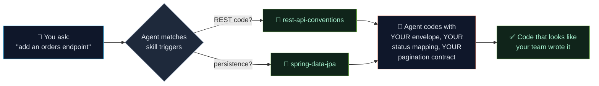

# rrezartprebreza/spring-boot-skills

Production-grade Claude Code and Codex skills for Spring Boot developers

## features

AI coding agents are great at Python. They hallucinate in Spring Boot.

They generate `@Autowired` field injection instead of constructor injection. They use `ResponseEntity<?>` where you have a standard response wrapper. They ignore your existing exception hierarchy and invent a new one. They don't know your project uses Flyway, so they generate schema SQL by hand. They emit pre-GA Spring AI artifact names that no longer exist in Maven Central.

**Skills fix this.** A skill is a markdown file your agent reads before touching your code. It tells the agent *your* conventions, your stack, your gotchas — not generic Spring Boot from 2020.



This repo is a collection of battle-tested skills. Copy, adapt, drop in.

---

## tools

| Skill | Description | Tags |
|-------|-------------|------|
| [**rest-api-conventions**](skills/spring-boot-4/rest-api-conventions/) | Your project's response envelope, error codes, pagination contract, versioning strategy. Fill in the template. | `rest` `api` |
| [**openapi-first**](skills/spring-boot-4/openapi-first/) | Generate controllers and DTOs from OpenAPI spec. Uses `openapi-generator-maven-plugin`. | `openapi` `codegen` |
| [**problem-details-rfc9457**](skills/spring-boot-4/problem-details-rfc9457/) | RFC 9457 compliant error responses with Spring's `ProblemDetail`. Replaces ad-hoc error envelopes. | `error-handling` `rest` |
| [**hateoas**](skills/spring-boot-4/hateoas/) | Spring HATEOAS link building conventions. Teaches agent when and how to add hypermedia links. | `hateoas` `rest` |

## installation

**1. Prepare your coding agent**

Install Claude Code if needed:
```bash
npm install -g @anthropic-ai/claude-code
```

If you use Codex, confirm the CLI or desktop app command is available:
```bash
codex --version
```

**2. Drop a skill into your project**

Claude Code:
```bash
PROJECT_DIR=/path/to/my-spring-app
mkdir -p "$PROJECT_DIR/.claude/skills"

## limitations

- [x] Skills for Spring Batch
- [x] Spring Boot 4 versions of all 30 skills (`skills/spring-boot-4/`)
- [x] Skills for Spring Cloud Gateway
- [x] Skills for Spring WebFlux / reactive patterns
- [x] Skills for multi-tenancy
- [x] Spring Boot 3 → 4 migration skill
- [x] Production observability skill
- [x] Event-driven messaging skill
- [x] Container and native deployment skill
- [x] CLAUDE.md and AGENTS.md templates for Boot 3 and Boot 4
- [ ] `/generate-endpoint` command
- [ ] `/write-test` command
- [ ] `/db-migrate` command
- [ ] Integration with [Hatch](https://github.com/rrezartprebreza/hatch) background job library
- [ ] Integration with [SpringPulse](https://github.com/rrezartprebreza/springpulse) observability

---
