# run-llama/liteparse

A fast, helpful, and open-source document parser

## features

- **Fast Text Parsing**: Spatial text parsing using PDFium
- **Flexible OCR System**:
  - **Built-in**: Tesseract (zero setup, bundled with the library)
  - **HTTP Servers**: Plug in any OCR server (EasyOCR, PaddleOCR, custom)
  - **Standard API**: Simple, well-defined OCR API specification
- **Complexity Detection**: Cheaply check whether a document needs OCR or heavier parsing — route, reject, or estimate cost before a full parse
- **Screenshot Generation**: Generate high-quality page screenshots for LLM agents
- **Multiple Output Formats**: Markdown, JSON, and Text
- **Markdown Output**: Structured Markdown with headings, tables, lists, images, and links — great for feeding LLMs and RAG pipelines
- **Bounding Boxes**: Precise text positioning information
- **Multi-language**: Use from Rust, Node.js/TypeScript, Python, or the browser (WASM)
- **Multi-platform**: Linux, macOS (Intel/ARM), Windows

```mermaid
flowchart LR
      subgraph Input["Input Formats"]
          direction TB
          PDF["PDF"]
          DOCX["DOCX"]
          XLSX["XLSX"]
          PPTX["PPTX"]
          IMG["Images"]
      end

      subgraph Core["Rust Core"]
          direction TB
          CONV["Format Conversion\nLibreOffice / Rust image + resvg + usvg crates"]
          EXTRACT["Text Extraction\nPDFium C library"]
          OCR["Selective OCR\nTesseract / HTTP / Custom"]
          MERGE["OCR Merge\nNative text + OCR results"]
          PROJ["Grid Projection\nSpatial layout reconstruction"]
          CONV --> EXTRACT
          EXTRACT --> OCR --> MERGE --> PROJ
          EXTRACT --> MERGE
      end

      subgraph Output[" Output "]
          direction TB
          JSON["Structured JSON\ntext + bounding boxes"]
          TEXT["Plain Text\nlayout-preserved"]
          SCREEN["Screenshots\nPNG rendering"]
      end

      subgraph Bindings["Language Bindings"]
          direction TB
          NAPI["Node.js / TypeScript\nnapi-rs"]
          PYO3["Python\nPyO3"]
          WASM["Browser / WASM\nwasm-bindgen"]
          CLI["CLI\ncargo / npm / pip"]
          NAPI ~~~ PYO3 ~~~ WASM ~~~ CLI
      end

      PDF --> EXTRACT
      DOCX & XLSX & PPTX & IMG --> CONV
      PROJ --> JSON & TEXT & SCREEN
      JSON & TEXT & SCREEN --> Bindings

      style Input fill:#F5F5F5,color:#000000,stroke:#37D7FA,stroke-width:2px
      style Core fill:#F5F5F5,color:#000000,stroke:#3E18F9,stroke-width:2px
      style Output fill:#F5F5F5,color:#000000,stroke:#FF8705,stroke-width:2px
      style Bindings fill:#F5F5F5,color:#000000,stroke:#FF8DF2,stroke-width:2px

      style PDF fill:#96E7F9,color:#000000,stroke:#37D7FA,stroke-width:1px
      style DOCX fill:#96E7F9,color:#000000,stroke:#37D7FA,stroke-width:1px
      style XLSX fill:#96E7F9,color:#000000,stroke:#37D7FA,stroke-width:1px
      style PPTX fill:#96E7F9,color:#000000,stroke:#37D7FA,stroke-width:1px
      style IMG fill:#96E7F9,color:#000000,stroke:#37D7FA,stroke-width:1px

      style CONV fill:#92AEFF,color:#000000,stroke:#4B72FE,stroke-width:1px
      style EXTRACT fill:#92AEFF,color:#000000,stroke:#4B72FE,stroke-width:1px
      style OCR fill:#92AEFF,color:#000000,stroke:#4B72FE,stroke-width:1px
      style MERGE fill:#92AEFF,color:#000000,stroke:#4B72FE,stroke-width:1px
      style PROJ fill:#4B72FE,color:#FFFFFF,stroke:#3E18F9,stroke-width:2px

      style JSON fill:#FFBD74,color:#000000,stroke:#FF8705,stroke-width:1px
      style TEXT fill:#FFBD74,color:#000000,stroke:#FF8705,stroke-width:1px
      style SCREEN fill:#FFBD74,color:#000000,stroke:#FF8705,stroke-width:1px

      style NAPI fill:#FFBFF8,color:#000000,stroke:#FF8DF2,stroke-width:1px
      style PYO3 fill:#FFBFF8,color:#000000,stroke:#FF8DF2,stroke-width:1px
      style WASM fill:#FFBFF8,color:#000000,stroke:#FF8DF2,stroke-width:1px
      style CLI fill:#FFBFF8,color:#000000,stroke:#FF8DF2,stroke-width:1px
```



## installation

Install via your preferred package manager. All versions (except WASM) ship with the same `lit` CLI.

| Language | Install | Library Docs |
|----------|---------|--------------|
| **Node.js / TypeScript** | `npm i -g @llamaindex/liteparse` | [Node.js README](packages/node/README.md) |
| **Python** | `pip install liteparse` | [Python README](packages/python/README.md) |
| **Rust** | `cargo install liteparse` (CLI) / `cargo add liteparse` (lib) | [Rust README (crates.io)](crates/liteparse/README.md) |
| **Browser (WASM)** | `npm i @llamaindex/liteparse-wasm` | [WASM README](packages/wasm/README.md) |

### Agent Skill

You can use `liteparse` as an agent skill, downloading it with the `skills` CLI tool:

```bash
npx skills add run-llama/llamaparse-agent-skills --skill liteparse
```

Or copy-pasting the [`SKILL.md`](https://github.com/run-llama/llamaparse-agent-skills/blob/main/skills/liteparse/SKILL.md) file to your own skills setup.

See the [Agent Skill guide](https://developers.llamaindex.ai/liteparse/guides/agent-skill/?utm_source=github&utm_medium=liteparse) for requirements and usage patterns.

## tools

The CLI is the same across all installations (`npm`, `pip`, `cargo install`).

### Parse Files

```bash
# Basic parsing
lit parse document.pdf

# Parse to Markdown — headings, tables, lists, images, links
lit parse document.pdf --format markdown -o output.md

# Parse with specific format
lit parse document.pdf --format json -o output.json

# Parse specific pages
lit parse document.pdf --target-pages "1-5,10,15-20"

# Parse without OCR
lit parse document.pdf --no-ocr

# Include page-scoped vector path data in JSON
lit parse document.pdf --format json --extract-vector-graphics

# Include rich per-item PDF text metadata
lit parse document.pdf --format json --extract-text-metadata

# Include page annotations in structured JSON
lit parse document.pdf --format json --extract-annotations

# Include AcroForm widget fields and values (repairs orphaned widgets in memory)
lit parse document.pdf --format json --extract-form-fields

# Parse a remote PDF
curl -sL https://example.com/report.pdf | lit parse -
```

### Markdown Output

LiteParse can render documents directly to Markdown. This means reconstructing headings,
tables, lists, images, and links from the spatial layout. This is ideal for
feeding documents to LLMs and RAG pipelines. This mode is purely heuristics and rule-based,
so complex documents may not render perfectly, but it will be fast.

```bash
# Render to Markdown
lit parse document.pdf --format markdown -o output.md

# Strip images instead of emitting placeholders
lit parse document.pdf --format markdown --image-mode off

# Extract embedded images to disk and reference them from the markdown
lit parse document.pdf --format markdown --image-mode embed --extract-images --image-output-dir ./images

# Extract image bytes and metadata without changing Markdown image handling
lit parse document.pdf --format json --extract-images

# Emit link text as plain text (no [text](url) syntax)
lit parse document.pdf --format markdown --no-links

# Include tagged-PDF logical structure in JSON
lit parse document.pdf --format json --extract-structure-tree

# Include the classified layout blocks (with bounding boxes) in JSON
lit parse document.pdf --format json --extract-blocks
```

Image handling is controlled by `--image-mode`:

| Mode | Behavior |
|------|----------|
| `placeholder` (default) | Emits `` references in reading order |
| `off` | Strips images entirely |
| `embed` | Emits the same image references as `placeholder` |

`--extract-images` is the only option that enables embedded-image extraction.
`--image-output-dir` requires it and writes the extracted bytes to disk. JSON output
contains each image's `name`, `path`, page bbox, intrinsic pixel dimensions, rotation,
format, and duplicate relationship; pixel bytes are never embedded in JSON. Identical
image resources reuse the same output file.

Library callers can opt in with `extract_images: true` (Rust), `extractImages: true`
(Node/WASM), or `extract_images=True` (Python). It defaults to false. Markdown image
mode controls presentation only; placeholder refs are still discovered without bytes.

> Markdown reconstruction quality varies with document complexity. For the
> hardest documents (dense tables, multi-column layouts, scans),
> [LlamaParse](https://developers.llamaindex.ai/python/cloud/llamaparse/?utm_source=github&utm_medium=liteparse)
> remains the most accurate option.

### Vector Graphics

Vector path output is opt-in because path-heavy PDFs can produce large payloads.
Enable it with `--extract-vector-graphics`, Rust/Python
`extract_vector_graphics = true`, or JavaScript/WASM
`extractVectorGraphics: true`. Each page then includes `vector_graphics`
(`vectorGraphics` in JavaScript) with:

- `shapes`: path bounding box, stroke/fill paint state and ARGB colors, and
  whether the path contains a Bezier curve.
- `lines`: compatible horizontal/vertical segments merged using stroke width
  and paint colors, with top-left 72-DPI viewport coordinates.

The repre

## configuration

| Variable | Description |
|----------|-------------|
| `TESSDATA_PREFIX` | Path to a directory containing Tesseract `.traineddata` files. Used for offline/air-gapped environments. |

## Development

The project is a Rust workspace with the core library and language-specific binding crates.

```
crates/
├── liteparse/          # Core library + CLI binary
├── liteparse-napi/     # Node.js bindings (napi-rs)
├── liteparse-python/   # Python bindings (PyO3)
├── liteparse-wasm/     # WASM bindings (wasm-bindgen)
├── pdfium/             # PDFium Rust wrapper
└── pdfium-sys/         # PDFium FFI bindings
packages/
├── node/               # npm package (TS wrapper + native binary)
├── python/             # PyPI package (Python wrapper + native binary)
└── wasm/               # WASM npm package
```

### Building

```bash
# Build the CLI
cargo build --release -p liteparse

# Build Node.js bindings
cd packages/node && npm run build

# Build Python bindings
cd packages/python && maturin develop --release

# Build WASM
cd packages/wasm && npm run build
```

We provide a fairly rich `AGENTS.md`/`CLAUDE.md` that we recommend using to help with development + coding agents.

## License

Apache 2.0

## Credits

Built on top of:

- [PDFium](https://pdfium.googlesource.com/pdfium/) - PDF rendering and text extraction
- [Tesseract](https://github.com/tesseract-ocr/tesseract) - OCR engine (via tesseract-rs)
- [EasyOCR](https://github.com/JaidedAI/EasyOCR) - HTTP OCR server (optional)
- [PaddleOCR](https://github.com/PaddlePaddle/PaddleOCR) - HTTP OCR server (optional)
- [napi-rs](https://napi.rs/) - Node.js native bindings
- [PyO3](https://pyo3.rs/) - Python native bindings
- [wasm-bindgen](https://github.com/wasm-bindgen/wasm-bindgen) - WebAssembly bindings
