# run-llama/liteparse

A fast, helpful, and open-source document parser

## features

- **Fast Text Parsing**: Spatial text parsing using PDFium
- **Flexible OCR System**:
  - **Built-in**: Tesseract (zero setup, bundled with the library)
  - **HTTP Servers**: Plug in any OCR server (EasyOCR, PaddleOCR, custom)
  - **Standard API**: Simple, well-defined OCR API specification
- **Complexity Detection**: Cheaply check whether a document needs OCR or heavier parsing — route, reject, or estimate cost before a full parse
- **Screenshot Generation**: Generate high-quality page screenshots for LLM agents
- **Multiple Output Formats**: Markdown, JSON, and Text
- **Markdown Output**: Structured Markdown with headings, tables, lists, images, and links — great for feeding LLMs and RAG pipelines
- **Bounding Boxes**: Precise text positioning information
- **Multi-language**: Use from Rust, Node.js/TypeScript, Python, or the browser (WASM)
- **Multi-platform**: Linux, macOS (Intel/ARM), Windows

```mermaid
flowchart LR
      subgraph Input["Input Formats"]
          direction TB
          PDF["PDF"]
          DOCX["DOCX"]
          XLSX["XLSX"]
          PPTX["PPTX"]
          IMG["Images"]
      end

      subgraph Core["Rust Core"]
          direction TB
          CONV["Format Conversion\nLibreOffice / Rust image + resvg + usvg crates"]
          EXTRACT["Text Extraction\nPDFium C library"]
          OCR["Selective OCR\nTesseract / HTTP / Custom"]
          MERGE["OCR Merge\nNative text + OCR results"]
          PROJ["Grid Projection\nSpatial layout reconstruction"]
          CONV --> EXTRACT
          EXTRACT --> OCR --> MERGE --> PROJ
          EXTRACT --> MERGE
      end

      subgraph Output[" Output "]
          direction TB
          JSON["Structured JSON\ntext + bounding boxes"]
          TEXT["Plain Text\nlayout-preserved"]
          SCREEN["Screenshots\nPNG rendering"]
      end

      subgraph Bindings["Language Bindings"]
          direction TB
          NAPI["Node.js / TypeScript\nnapi-rs"]
          PYO3["Python\nPyO3"]
          WASM["Browser / WASM\nwasm-bindgen"]
          CLI["CLI\ncargo / npm / pip"]
          NAPI ~~~ PYO3 ~~~ WASM ~~~ CLI
      end

      PDF --> EXTRACT
      DOCX & XLSX & PPTX & IMG --> CONV
      PROJ --> JSON & TEXT & SCREEN
      JSON & TEXT & SCREEN --> Bindings

      style Input fill:#F5F5F5,color:#000000,stroke:#37D7FA,stroke-width:2px
      style Core fill:#F5F5F5,color:#000000,stroke:#3E18F9,stroke-width:2px
      style Output fill:#F5F5F5,color:#000000,stroke:#FF8705,stroke-width:2px
      style Bindings fill:#F5F5F5,color:#000000,stroke:#FF8DF2,stroke-width:2px

      style PDF fill:#96E7F9,color:#000000,stroke:#37D7FA,stroke-width:1px
      style DOCX fill:#96E7F9,color:#000000,stroke:#37D7FA,stroke-width:1px
      style XLSX fill:#96E7F9,color:#000000,stroke:#37D7FA,stroke-width:1px
      style PPTX fill:#96E7F9,color:#000000,stroke:#37D7FA,stroke-width:1px
      style IMG fill:#96E7F9,color:#000000,stroke:#37D7FA,stroke-width:1px

      style CONV fill:#92AEFF,color:#000000,stroke:#4B72FE,stroke-width:1px
      style EXTRACT fill:#92AEFF,color:#000000,stroke:#4B72FE,stroke-width:1px
      style OCR fill:#92AEFF,color:#000000,stroke:#4B72FE,stroke-width:1px
      style MERGE fill:#92AEFF,color:#000000,stroke:#4B72FE,stroke-width:1px
      style PROJ fill:#4B72FE,color:#FFFFFF,stroke:#3E18F9,stroke-width:2px

      style JSON fill:#FFBD74,color:#000000,stroke:#FF8705,stroke-width:1px
      style TEXT fill:#FFBD74,color:#000000,stroke:#FF8705,stroke-width:1px
      style SCREEN fill:#FFBD74,color:#000000,stroke:#FF8705,stroke-width:1px

      style NAPI fill:#FFBFF8,color:#000000,stroke:#FF8DF2,stroke-width:1px
      style PYO3 fill:#FFBFF8,color:#000000,stroke:#FF8DF2,stroke-width:1px
      style WASM fill:#FFBFF8,color:#000000,stroke:#FF8DF2,stroke-width:1px
      style CLI fill:#FFBFF8,color:#000000,stroke:#FF8DF2,stroke-width:1px
```

## installation

Install via your preferred package manager. All versions (except WASM) ship with the same `lit` CLI.

| Language | Install | Library Docs |
|----------|---------|--------------|
| **Node.js / TypeScript** | `npm i -g @llamaindex/liteparse` | [Node.js README](packages/node/README.md) |
| **Python** | `pip install liteparse` | [Python README](packages/python/README.md) |
| **Rust** | `cargo install liteparse` (CLI) / `cargo add liteparse` (lib) | [Rust README (crates.io)](crates/liteparse/README.md) |
| **Browser (WASM)** | `npm i @llamaindex/liteparse-wasm` | [WASM README](packages/wasm/README.md) |

## tools

The CLI is the same across all installations (`npm`, `pip`, `cargo install`).

## configuration

| Variable | Description |
|----------|-------------|
| `TESSDATA_PREFIX` | Path to a directory containing Tesseract `.traineddata` files. Used for offline/air-gapped environments. |
