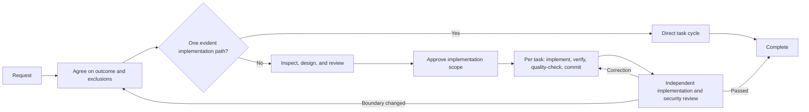

# shinpr/claude-code-workflows

Development workflows for Claude Code that keep broad exploration focused on the outcome you approved.

## installation

Requires a Claude Code release with plugin marketplace support.

### Choose a path

| What do you need? | Start with | Plugin |
|---|---|---|
| Deliver a backend, API, CLI, or general change end to end | `/recipe-implement` | `dev-workflows` |
| Design a backend or general change before implementation | `/recipe-design` | `dev-workflows` |
| Design and build a React / TypeScript frontend | `/recipe-front-design` → `/recipe-front-plan` → `/recipe-front-build` | `dev-workflows-frontend` |
| Deliver a backend and React frontend change together | `/recipe-fullstack-implement` | `dev-workflows-fullstack` |
| Review an implementation against its design | `/recipe-review` or `/recipe-front-review` | `dev-workflows` or `dev-workflows-frontend` |
| Investigate a problem before choosing a fix | `/recipe-diagnose` | Any workflow plugin |
| Document an existing system from its code | `/recipe-reverse-engineer` | `dev-workflows` or `dev-workflows-fullstack` |
| A throwaway experiment or prototype | Use Claude Code directly | None |

### Common setup

```bash
# 1. Start Claude Code
claude

# 2. Add the marketplace
/plugin marketplace add shinpr/claude-code-workflows
```

### Install one workflow plugin

Install the plugin that matches your project. If the install tells you to run `/reload-plugins`, do that before invoking the recipe.

```bash
# Backend or general
/plugin install dev-workflows@claude-code-workflows
/recipe-implement "Add rate limiting to the public API"

# Frontend
/plugin install dev-workflows-frontend@claude-code-workflows
/recipe-front-design "Add account recovery screens"

# Full-stack
/plugin install dev-workflows-fullstack@claude-code-workflows
/recipe-fullstack-implement "Add user authentication with JWT + login form"
```

Install only one workflow plugin. `dev-workflows-fullstack` already contains the backend and frontend workflows. If you previously used full-stack recipes from `dev-workflows`, migrate to `dev-workflows-fullstack`.

`/recipe-front-design` stops after the applicable UI Spec and Design Doc are reviewed and approved. Run `/recipe-front-plan` and `/recipe-front-build` when you are ready to continue. For a backend or general change, `/recipe-design`, `/recipe-plan`, and `/recipe-build` provide the same staged path.

### Team setup

Claude Code supports project-scoped marketplaces and plugins. Commit the resulting `.claude/settings.json` so contributors are prompted to use the same workflow plugin.

```bash
claude plugin marketplace add shinpr/claude-code-workflows --scope project
claude plugin install dev-workflows-fullstack@claude-code-workflows --scope project
```

Replace `dev-workflows-fullstack` with the plugin that matches the repository. See the [Claude Code plugin documentation](https://code.claude.com/docs/en/discover-plugins#configure-team-marketplaces) for project and managed installation options.

---

## How It Works



The number of product and design decisions determines the route, not file count or the amount of implementation work:

| Scale | What the change needs | What happens |
|-------|-----------------------|--------------|
| Small | One outcome that follows an existing pattern within one responsibility | Direct task cycle → focused and repository checks → security review |
| Medium | One outcome that crosses responsibilities or needs a lasting design decision | Reviewed Design Doc, plus UI Spec / ADR when required → selected integration/E2E proof → reviewed Work Plan → task cycles → final review |
| Large | Mul
