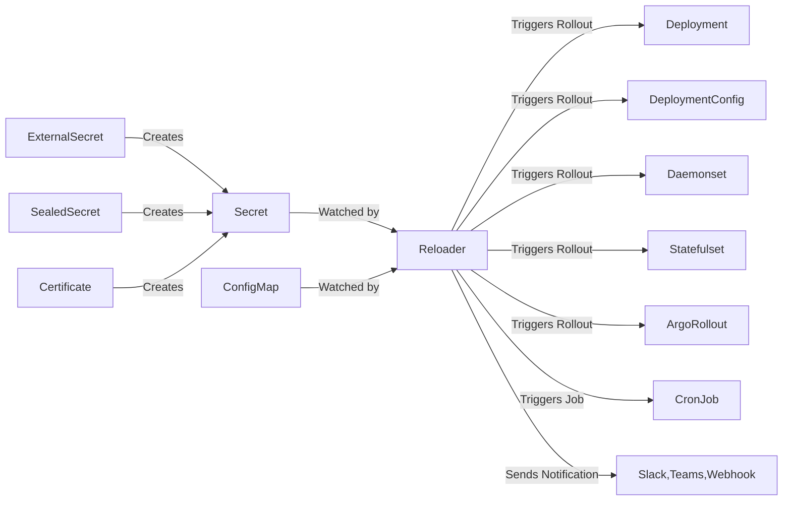

# stakater/Reloader

A Kubernetes controller to watch changes in ConfigMap and Secrets and do rolling upgrades on Pods with their associated Deployment, StatefulSet, DaemonSet and DeploymentConfig – [✩Star] if you're usin

## features

- ✅ **Zero manual restarts**: No need to manually rollout workloads after config/secret changes.
- 🔒 **Secure by design**: Ensure your apps always use the most up-to-date credentials or tokens.
- 🛠️ **Flexible**: Works with all major workload types — Deployment, StatefulSet, Daemonset, ArgoRollout, and more.
- ⚡ **Fast feedback loop**: Ideal for CI/CD pipelines where secrets/configs change frequently.
- 🔄 **Out-of-the-box integration**: Just label your workloads and let Reloader do the rest.

## 🔧 How It Works?



- Sources like `ExternalSecret`, `SealedSecret`, or `Certificate` from `cert-manager` can create or manage Kubernetes `Secrets` — but they can also be created manually or delivered through GitOps workflows.
- `Secrets` and `ConfigMaps` are watched by Reloader.
- When changes are detected, Reloader automatically triggers a rollout of the associated workloads, ensuring your app always runs with the latest configuration.

## 🏢 Reloader Enterprise

Reloader OSS is free and production-proven with 24B+ downloads.

For teams with stricter requirements:

| Need | Enterprise |
|------|-----------|
| CVE-free, signed images with SBOM | ✅ |
| SLA-backed support from Kubernetes experts | ✅ |
| Artifact provenance for compliance audits | ✅ |
| Dedicated escalation path | ✅ |

→ [Contact Sales](mailto:sales@stakater.com) for info about Reloader Enterprise.

## installation

### 1. Install Reloader

Follow any of this [installation options](#-installation).

### 2. Annotate Your Workload

To enable automatic reload for a Deployment:

```yaml
apiVersion: apps/v1
kind: Deployment
metadata:
  name: my-app
  annotations:
    reloader.stakater.com/auto: "true"
spec:
  template:
    metadata:
      labels:
        app: my-app
    spec:
      containers:
        - name: app
          image: your-image
          envFrom:
            - configMapRef:
                name: my-config
            - secretRef:
                name: my-secret
```

This tells Reloader to watch the `ConfigMap` and `Secret` referenced in this deployment. When either is updated, it will trigger a rollout.

## tools

Reloader supports multiple annotation-based controls to let you **customize when and how your Kubernetes workloads are reloaded** upon changes in `Secrets` or `ConfigMaps`.

Kubernetes does not trigger pod restarts when a referenced `Secret` or `ConfigMap` is updated. Reloader bridges this gap by watching for changes and automatically performing rollouts — but it gives you full control via annotations, so you can:

- Reload **all** resources by default
- Restrict reloads to only **Secrets** or only **ConfigMaps**
- Watch only **specific resources**
- Use **opt-in via tagging** (`search` + `match`)
- Exclude workloads you don’t want to reload

### 1. 🔁 Automatic Reload (Default)

Use these annotations to automatically restart the workload when referenced `Secrets` or `ConfigMaps` change.

| Annotation                                 | Description                                                          |
|--------------------------------------------|----------------------------------------------------------------------|
| `reloader.stakater.com/auto: "true"`       | Reloads workload when any referenced ConfigMap or Secret changes     |
| `secret.reloader.stakater.com/auto: "true"`| Reloads only when referenced Secret(s) change                        |
| `configmap.reloader.stakater.com/auto: "true"`| Reloads only when referenced ConfigMap(s) change                  |

### 2. 📛 Named Resource Reload (Specific Resource Annotations)

These annotations allow you to manually define which ConfigMaps or Secrets should trigger a reload, regardless of whether they're used in the pod spec.

| Annotation                                          | Description                                                                          |
|-----------------------------------------------------|--------------------------------------------------------------------------------------|
| `secret.reloader.stakater.com/reload: "my-secret"`  | Reloads when specific Secret(s) change, regardless of how they're used              |
| `configmap.reloader.stakater.com/reload: "my-config"`| Reloads when specific ConfigMap(s) change, regardless of how they're used         |

#### Use when

1. ✅ This is useful in tightly scoped scenarios where config is shared but reloads are only relevant in certain cases.
1. ✅ Use this when you know exactly which resource(s) matter and want to avoid auto-discovery or searching altogether.

### 3. 🎯 Targeted Reload (Match + Search Annotations)

This pattern allows fine-grained reload control — workloads only restart if the Secret/ConfigMap is both:

1. Referenced by the workload
1. Explicitly annotated with `match: true`

| Annotation                                | Applies To   | Description                                                                 |
|-------------------------------------------|--------------|-----------------------------------------------------------------------------|
| `reloader.stakater.com/search: "true"`    | Workload     | Enables search mode (only reloads if matching secrets/configMaps are found) |
| `reloader.stakater.com/match: "true"`     | ConfigMap/Secret | Marks the config/secret as eligible for reload in search mode              |

#### How it works

1. The workload must have: `reloader.stakater.com/search: "true"`
1. The ConfigMap or Secret must have: `reloader.stakater.com/match: "true"`
1. The resource (ConfigMap or Secret) must also be referenced in the workload (via env, `volumeMount`, etc.)

#### Use when

1. ✅ You want to reload a workload only if it references a ConfigMap or Secret that has been explicitly tagged with `reloader.stakater.com/match: "true"`.
1. ✅ Use this when you want full control over which shared or system-wide resources trigger reloads. Great in multi-tenant clusters or shared configs.

### ⛔ Resource-Level Ignore Annotation

When you need to prevent specific ConfigMaps or Secrets from triggering any reloads, use the ignore annotation on the resource itself:

```y

## configuration

These flags let you customize Reloader's behavior globally, at the Reloader controller level.

#### 1. 🔁 Reload Behavior

| Flag | Description |
|------|-------------|
| `--reload-on-create=true` | Reload workloads when a watched ConfigMap or Secret is created |
| `--reload-on-delete=true` | Reload workloads when a watched ConfigMap or Secret is deleted |
| `--auto-reload-all=true` | Automatically reload all workloads unless opted out (`auto: "false"`) |
| `--reload-strategy=env-vars` | Strategy to use for triggering reload (`env-vars` or `annotations`) |
| `--log-format=json` | Enable JSON-formatted logs for better machine readability |

##### Reload Strategies

Reloader supports multiple strategies for triggering rolling updates when a watched `ConfigMap` or `Secret` changes. You can configure the strategy using the `--reload-strategy` flag.

| Strategy     | Description |
|--------------|-------------|
| `env-vars` (default) | Adds a dummy environment variable to any container referencing the changed resource (e.g., `Deployment`, `StatefulSet`, etc.). This forces Kubernetes to perform a rolling update. |
| `annotations` | Adds a `reloader.stakater.com/last-reloaded-from` annotation to the pod template metadata. Ideal for GitOps tools like ArgoCD, as it avoids triggering unwanted sync diffs. |

- The `env-vars` strategy is the default and works in most setups.
- The `annotations` strategy is preferred in **GitOps environments** to prevent config drift in tools like ArgoCD or Flux.
- In `annotations` mode, a `ConfigMap` or `Secret` that is deleted and re-created will still trigger a reload (since previous state is not tracked).

#### 2. 🚫 Resource Filtering

| Flag | Description |
|------|-------------|
| `--resources-to-ignore=configmaps` | Ignore ConfigMaps (only one type can be ignored at a time) |
| `--resources-to-ignore=secrets` | Ignore Secrets (cannot combine with configMaps) |
| `--ignored-workload-types=jobs,cronjobs` | Ignore specific workload types from reload monitoring |
| `--resource-label-selector=key=value` | Only watch ConfigMaps/Secrets with matching labels |

> **⚠️ Note:**
>
> Only **one** resource type can be ignored at a time.
> Trying to ignore **both `configmaps` and `secrets`** will cause an error in Reloader.
> ✅ **Workaround:** Scale the Reloader deployment to `0` replicas if you want to disable it completely.

**💡 Workload Type Examples:**

```bash
# Ignore only Jobs
--ignored-workload-types=jobs

# Ignore only CronJobs
--ignored-workload-types=cronjobs

# Ignore both (comma-separated)
--ignored-workload-types=jobs,cronjobs
```

> **🔧 Use Case:** Ignoring workload types is useful when you don't want certain types of workloads to be automatically reloaded.

#### 3. 🧩 Namespace Filtering

| Flag | Description |
|------|-------------|
| `--namespace-selector='key=value'` <br /> <br />`--namespace-selector='key1=value1,key2=value2'` <br /> <br />`--namespace-selector='key in (value1,value2)'`| Watch only namespaces with matching labels. See [LIST and WATCH filtering](https://kubernetes.io/docs/concepts/overview/working-with-objects/labels/#list-and-watch-filtering) for more details on label selectors |
| `--namespaces-to-ignore=ns1,ns2` | Skip specific namespaces from being watched |

#### 4. 📝 Annotation Key Overrides

These flags allow you to redefine annotation keys used in your workloads or resources:

| Flag | Overrides |
|------|-----------|
| `--auto-annotation` | Overrides `reloader.stakater.com/auto` |
| `--secret-auto-annotation` | Overrides `secret.reloader.stakater.com/auto` |
| `--configmap-auto-annotation` | Overrides `configmap.reloader.stakater.com/auto` |
| `--auto-search-annotation` | Overrides `reloader.stakater.com/search` |
| `--search-match-annotation` | Overrides `reloader.stakater.com/match` |
| `--secret-annotation` | Overrides `secret.reloader.stakater.com/reload` |
| `--configmap-annotation` | Overrides `configmap.reloader.stakater.com/reload` |
| `--ignore-annotation` | Ove
