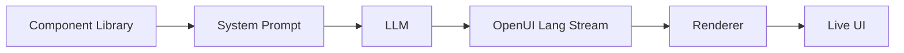

# thesysdev/openui

The Open Standard for Generative UI

## installation

```bash
npx @openuidev/cli@latest create --name genui-chat-app
cd genui-chat-app
echo "OPENAI_API_KEY=sk-your-key-here" > .env
npm run dev
```

This is the fastest way to start with OpenUI. The scaffolded app gives you an end-to-end starting point with streaming, built-in UI, and OpenUI Lang support.

What this gives you:

- **OpenUI Lang support** - Start with structured UI generation built into the app flow.
- **Library-driven prompts** - Generate instructions from your allowed component set.
- **Streaming support** - Update the UI progressively as output arrives.
- **Working app foundation** - Start from a ready-to-run example instead of wiring everything manually.

## How it works

Your components define what the model can generate.



1. Define or reuse a component library.
2. Generate a system prompt from that library.
3. Send that prompt to your model.
4. Stream OpenUI Lang output back to the client.
5. Render the output progressively with Renderer.

Try it yourself in the [Playground](https://www.openui.com/playground): generate UI live with the default component library.

## Packages

| Package                                                                                                    | Best for                                         | Description                                                                                                  |
| :--------------------------------------------------------------------------------------------------------- | :----------------------------------------------- | :----------------------------------------------------------------------------------------------------------- |
| [`@openuidev/lang-core`](./packages/lang-core)                                                             | Framework-agnostic parsing and prompt generation | Core parser, prompt-generation, runtime-evaluation, and type layer with no React, Vue, or Svelte dependency  |
| [`@openuidev/langchain`](./packages/langchain)                                                             | LangChain and LangGraph agents                   | Agent transformer and server helpers that stream OpenUI through AG-UI                                        |
| [`@openuidev/react-lang`](./packages/react-lang)                                                           | React rendering runtimes                         | Define component libraries, generate prompts, and render streamed OpenUI Lang in React                       |
| [`@openuidev/react-headless`](./packages/react-headless)                                                   | Bring-your-own React chat UI                     | Headless chat state, streaming adapters, and message format converters                                       |
| [`@openuidev/react-ui`](./packages/react-ui)                                                               | Fastest path to a full React chat experience     | Prebuilt chat layouts, standalone UI primitives, and two built-in component libraries                        |
| [`@openuidev/react-email`](./packages/react-email)                                                         | Email generation and HTML export                 | React Email component definitions plus prompt options for model-generated emails                             |
| [`@openuidev/vue-lang`](./packages/vue-lang)                                                               | Vue integrations                                 | Vue 3 bindings for defining model-renderable components and rendering streamed OpenUI Lang                   |
| [`@openuidev/svelte-lang`](./packages/svelte-lang)                                                         | Svelte integrations                              | Svelte 5 bindings for defining model-renderable components and rendering streamed OpenUI Lang

## features

OpenUI Lang is designed for model-generated UI that needs to be both structured and streamable.

- **Streaming output** - Emit UI incrementally as tokens arrive.
- **Token efficiency** - Up to 67% fewer tokens than equivalent JSON (see [benchmarks](./benchmarks)).
- **Controlled rendering** - Restrict output to the components you define and register.
- **Typed component contracts** - Define component props and structure up front with Zod schemas.

### Token efficiency benchmarks

Measured with `tiktoken` (GPT-5 encoder). OpenUI Lang vs two JSON-based streaming formats across seven UI scenarios:

| Scenario           | Vercel JSON-Render | Thesys C1 JSON | OpenUI Lang |  vs Vercel |      vs C1 |
| ------------------ | -----------------: | -------------: | ----------: | ---------: | ---------: |
| simple-table       |                340 |            357 |         148 |     -56.5% |     -58.5% |
| chart-with-data    |                520 |            516 |         231 |     -55.6% |     -55.2% |
| contact-form       |                893 |            849 |         294 |     -67.1% |     -65.4% |
| dashboard          |               2247 |           2261 |        1226 |     -45.4% |     -45.8% |
| pricing-page       |               2487 |           2379 |        1195 |     -52.0% |     -49.8% |
| settings-panel     |               1244 |           1205 |         540 |     -56.6% |     -55.2% |
| e-commerce-product |               2449 |           2381 |        1166 |     -52.4% |     -51.0% |
| **TOTAL**          |          **10180** |       **9948** |    **4800** | **-52.8%** | **-51.7%** |

Full methodology and reproduction steps in [`benchmarks/`](./benchmarks).

## Documentation

Detailed documentation is available at [openui.com](https://openui.com).

## Repository structure

```
openui/
├── packages/
│   ├── react-lang/       # Core runtime (parser, renderer, prompt generation)
│   ├── react-headless/   # Headless chat state & streaming adapters
│   ├── react-ui/         # Prebuilt chat layouts & component libraries
│   ├── react-email/      # React Email component library for generated emails
│   ├── lang-core/        # Framework-agnostic parser, prompt, and runtime layer
│   ├── langchain/        # LangChain/LangGraph streaming integration
│   ├── vue-lang/         # Vue runtime bindings for OpenUI Lang
│   ├── svelte-lang/      # Svelte runtime bindings for OpenUI Lang
│   ├── browser-bundle/   # Script-tag bundle for CDN / iframe / no-build embeds
│   └── openui-cli/       # CLI for scaffolding & prompt generation
├── skills/
│   └── openui/           # Claude Code skill for AI-assisted development
├── examples/
│   └── openui-chat/      # Full working example app (Next.js)
├── docs/                 # Documentation site (openui.com)
└── benchmarks/           # Token efficiency benchmarks
```

Good places to start:

- [openui.com](https://openui.com) for the full docs
- [`examples/openui-chat`](./examples/openui-chat) for a working app
- [`CONTRIBUTING.md`](./CONTRIBUTING.md) if you want to contribute

## Community

- [Discord](https://discord.com/invite/Pbv5PsqUSv) - Ask questions, share what you're building
- [GitHub Issues](https://github.com/thesysdev/openui/issues) - Report bugs or request features

## How OpenUI compares

| Feature                |             OpenUI |           json-render (Vercel) |     A2UI (Google) | CopilotKit OpenGenUI |
| ---------------------- | -----------------: | -----------------------------: | ----------------: | -------------------: |
| Tokens                 |                 1x |                             3x |                3x |                   4x |
| Latency (60 tok/s)     |               4.9s |                          14.2s |             14.2s |                 ~20s |
| Streaming              |                Yes |                            Yes |               Yes |              Partial |
| Consistent output      |                Yes |                            Yes |         
