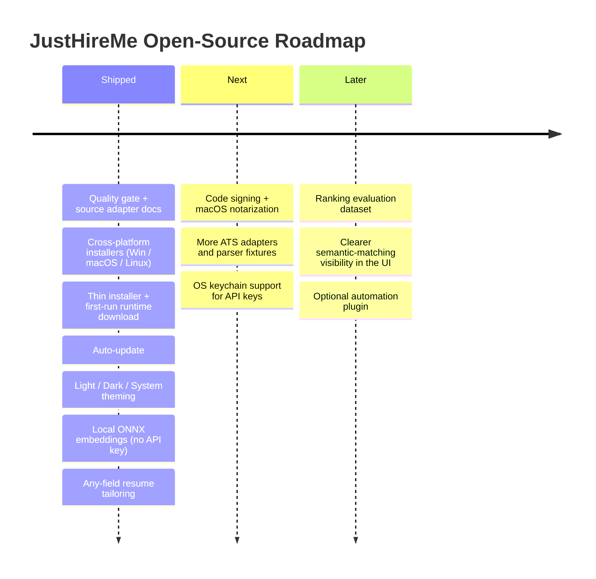

# vasu-devs/JustHireMe

Local-first AI job intelligence workbench for scraping roles, ranking fit, and generating tailored application materials.

## features

<table>
  <tr>
    <td width="50%">
      <h3>Scrape From Many Sources</h3>
      
Collect jobs from ATS/company boards, RSS feeds, Hacker News, GitHub-style sources, Reddit/community sources, APIs, and custom configured targets.

    </td>
    <td width="50%">
      <h3>Reject Low-Quality Leads</h3>
      
Apply a deterministic quality gate before saving leads. Filter stale, thin, senior-only, unpaid, spammy, or missing-context postings.

    </td>
  </tr>
  <tr>
    <td width="50%">
      <h3>Rank Fit Transparently</h3>
      
Score role alignment, stack coverage, project evidence, seniority fit, location constraints, red flags, source signal, and semantic profile similarity.

    </td>
    <td width="50%">
      <h3>Generate Tailored Packages</h3>
      
Create a resume PDF, cover letter PDF, founder message, LinkedIn note, cold email, keyword coverage summary, and selected-project rationale - for roles in any field, not just software.

    </td>
  </tr>
</table>

---

## installation

Use this path if you are not a developer and just want to run JustHireMe. Open the latest [GitHub Release](https://github.com/vasu-devs/JustHireMe/releases/latest) and grab the asset for your platform.

| Platform | Download | Notes |
| --- | --- | --- |
| Windows | `JustHireMe_*_x64-setup.exe` | If SmartScreen appears, click **More info** -> **Run anyway** |
| macOS (Apple Silicon) | `JustHireMe_*_aarch64.dmg` | Not yet notarized: if macOS says the app is damaged/unverified, allow it in **System Settings -> Privacy & Security -> Open Anyway** |
| Linux (Debian/Ubuntu) | `JustHireMe_*_amd64.deb` | `sudo dpkg -i` the file |
| Linux (portable) | `JustHireMe_*_amd64.AppImage` | `chmod +x` then run it |

**First launch downloads the runtime pack.** The first time you open the app it fetches the runtime (browser + vector libraries + embedding model) over HTTPS and caches it; this is a one-time download. After that, the app starts offline-ready and routine updates do not re-download it.

The app updates itself automatically from the latest GitHub release. Release notes include SHA256 checksums, and every installer is built by GitHub Actions from the release tag so the published binary matches the repository source.

## requirements

| Tool | Version |
| --- | --- |
| Node.js | 24 recommended; CI uses Node 24 |
| Python | 3.13+ |
| Rust | stable |
| uv | latest stable |
| Git | any modern version |

Optional:

- Ollama for local model experiments
- Playwright browser dependencies only for experimental automation work

## tools

| Task | Command |
| --- | --- |
| Install frontend dependencies | `npm ci` |
| Install backend dependencies | `cd backend && uv sync --dev` |
| Install website dependencies | `cd website && npm ci` |
| Frontend dev server | `npm run dev` |
| Website dev server | `cd website && npm run dev` |
| Desktop dev app | `npm run tauri dev` |
| Version consistency check | `npm run version:check` |
| TypeScript check | `npm run typecheck` |
| Frontend tests | `npm test` |
| Frontend build | `npm run build` |
| Backend tests | `cd backend && uv run python -m pytest tests -q` |
| Backend regression smoke | `cd backend && uv run python -m pytest tests/test_regressions.py tests/test_api.py::TestAuthGate` |
| Keyless LLM CLI smoke (Ollama/Claude Code/Codex CLI) | `npm run smoke:llm-cli` |
| Live source connectivity smoke | `npm run smoke:live-sources` |
| Rust tests | `cd src-tauri && cargo test --lib` |
| Rust check | `cd src-tauri && cargo check` |
| Website build | `cd website && npm run build` |
| All local checks | `npm run check` |
| Build sidecar | `npm run build:sidecar` |
| Build frontend, website, and Rust check | `npm run build:all` |
| Fast release smoke | `npm run release:smoke` |
| Release preflight | `npm run release:preflight` |
| Windows installer package rehearsal (requires updater signing env) | `npm run release:windows` |
| Linux packages | `npm run release:linux` |
| macOS package | `npm run release:macos` |

`npm run check` runs the version check, frontend typecheck, frontend tests, frontend build, website build, backend tests, Rust tests, and Rust check. Run `npm ci`, `cd backend && uv sync --dev`, and `cd website && npm ci` first so every lane has its dependencies.

On Windows PowerShell, use `npm.cmd` instead of `npm` if the `npm.ps1` shim is blocked by execution policy. If your shell does not support `&&`, run the `cd` command and the following command as separate lines.

---

## configuration

Settings are configured inside the desktop app. For v1, API keys are stored in local app settings.

Local data may include:

| Data | Stored Locally |
| --- | --- |
| Profile graph | yes |
| Vector tables | yes |
| Lead CRM | yes |
| Generated PDFs | yes |
| Settings | yes |
| Activity history | yes |

Do not share screenshots, logs, local app data, issue attachments, or database files that contain API keys, cookies, private resumes, or personal data.

Planned improvement:

- OS keychain-backed API key storage

---

## limitations

Near-term priorities:

- code signing for Windows and notarization for macOS (remove first-launch security warnings)
- more high-quality ATS/company source adapters
- stronger quality gate tests
- clearer vector matching state in the UI
- contributor-friendly source plugin boundaries
- OS keychain support for API keys

---
